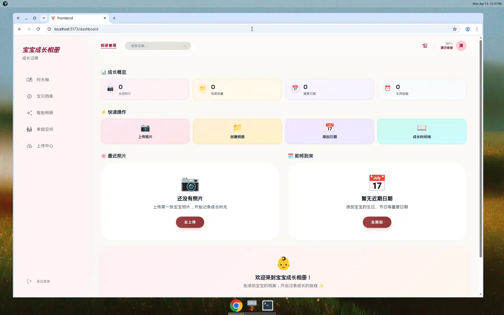
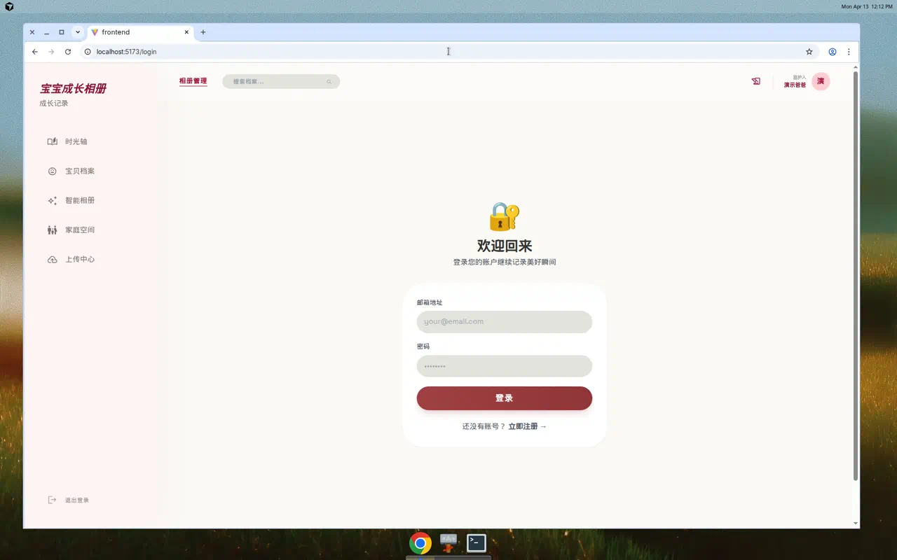
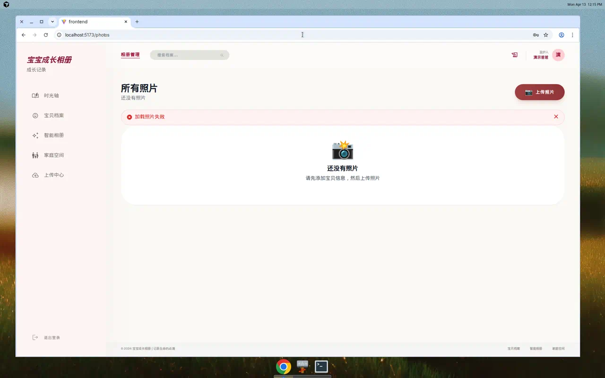

# 👶 宝宝成长相册（Baby Album）

一个全栈 TypeScript 项目，用于家庭协作记录宝宝成长照片与里程碑。

## 界面预览

| 首页 | 登录页 | 照片页 |
|---|---|---|
|  |  |  |

## 项目现状（2026-04）

- 架构：前后端分离（`backend` + `frontend`）。
- 后端：NestJS + Prisma，默认开发端口 `3001`。
- 前端：React + Vite，默认开发端口 `5173`（Vite 可能自动切换到其他可用端口）。
- 数据库：开发默认 SQLite（`backend/.env`），Docker 默认 PostgreSQL。
- 当前仓库存在一些历史遗留问题（见下方“已知问题”），文档以**当前代码实际状态**为准。

---

## 目录结构

- `backend/`：NestJS API 服务
- `frontend/`：React + Vite 前端
- `docs/`：项目文档
- `docker-compose*.yml`：容器部署与环境编排

---

## 环境要求

- Node.js >= 18
- npm >= 9
- （可选）Docker / Docker Compose

---

## 本地开发（推荐）

### 1) 安装依赖

在仓库根目录执行：

- `npm install`（会触发根 `postinstall`，自动执行 `backend` 的 Prisma generate）
- `npm --prefix frontend install`

### 2) 配置环境变量

- 后端：复制并编辑 `backend/.env.example` -> `backend/.env`
- 前端：复制并编辑 `frontend/.env.example` -> `frontend/.env`（如需）

### 3) 初始化数据库（后端）

- `npm run db:push`

> 等价于在 `backend` 下执行 `npx prisma db push`。

### 4) 启动服务

在两个终端分别执行：

- 后端：`npm run backend`（或 `npm --prefix backend run start:dev`）
- 前端：`npm run frontend`（或 `npm --prefix frontend run dev`）

访问地址：

- 前端：`http://localhost:5173`（或 Vite 实际输出端口）
- 后端健康检查：`http://localhost:3001/api/health`
- 后端 API 前缀：`/api`

---

## 常用命令

### 根目录

- `npm run backend`：启动后端开发服务
- `npm run frontend`：启动前端开发服务
- `npm run db:push`：推送 Prisma schema
- `npm run test`：运行根测试脚本（当前指向 `tests/auth-test.js`，但仓库暂无该目录，见“已知问题”）

### 后端（`backend/`）

- `npm run start:dev`
- `npm run test`
- `npm run lint`
- `npm run build`

### 前端（`frontend/`）

- `npm run dev`
- `npm run test`
- `npm run lint`
- `npm run build`

---

## Docker（可选）

常见用法：

- 开发叠加：`docker-compose -f docker-compose.yml -f docker-compose.dev.yml up`
- 生产叠加：`docker-compose -f docker-compose.yml -f docker-compose.prod.yml up`

说明：

- `docker-compose.yml` 中后端容器默认端口为 `3010`，与本地 Node 开发默认 `3001` 不同。
- 请按实际部署环境调整 `.env` 与 compose 覆盖文件。

---

## 已知问题（当前仓库真实状态）

- 前端 `npm run build` 当前失败（示例：`src/components/photo/CommentThread.tsx` 类型错误）。
- 前端 `npm run lint` 有大量历史遗留报错。
- 根脚本 `npm test` 指向 `tests/*.js`，但仓库当前无 `tests/` 目录。
- 前端环境示例文件使用 `VITE_API_URL`，但代码常量读取 `VITE_API_BASE_URL`，需要统一。

---

## 参考文档

- 总体部署：`docs/DEPLOYMENT_GUIDE.md`
- 后端说明：`backend/README.md`
- 前端开发：`frontend/README.dev.md`
- API 与架构：`backend/docs/ARCHITECTURE.md`

---

## 贡献

1. 从 `main` 拉新分支
2. 提交最小变更并附测试结果
3. 发起 Pull Request

