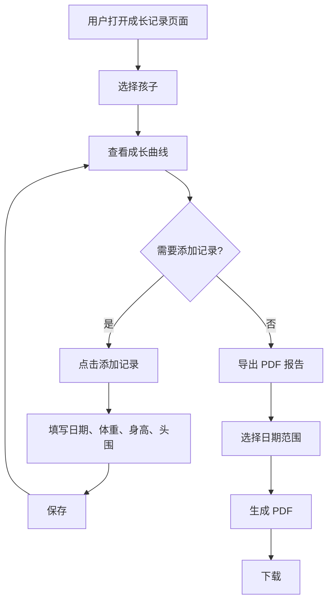
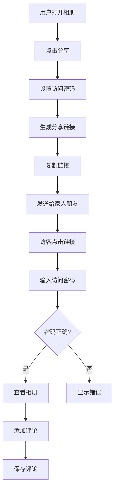
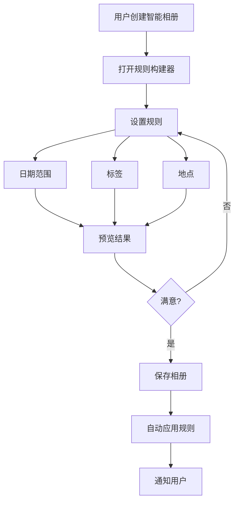

# Phase 3 v4.0 产品需求文档 (PRD)

**版本**: v4.0 Final (无 AI)
**发布日期**: 2026-02-14
**产品经理**: product-manager-4
**状态**: ✅ 最终批准

---

## 📋 执行摘要

Phase 3 v4.0 是**重大战略调整**，完全移除 AI 功能，专注于核心用户体验提升。

### 核心变化

| 指标 | v3.0 (含 AI) | **v4.0 (无 AI)** | 变化 |
|------|---------------|-----------------|------|
| **开发工时** | 256h | **140h** | **-116h (-45%)** |
| **月成本** | $138 | **$38** | **-$100 (-73%)** |
| **年度成本** | $1,656 | **$456** | **-$1,200 (-73%)** |
| **开发周期** | 6 周 | **3 周** | **-3 周 (-50%)** |

### 核心价值

- ✅ **成本优化**: 年省 $1,200 (73%)
- ✅ **快速交付**: 3 周完成 (vs 6 周)
- ✅ **技术简化**: 无需 AI 基础设施
- ✅ **专注体验**: 成长记录 + 社交分享

---

## 🎯 产品目标

### 主要目标

1. **提升用户留存** 30% (DAU/MAU)
2. **增加用户互动** 50% (评论、分享)
3. **降低运营成本** 73% ($1,200/年)
4. **快速交付市场** 3 周

### 成功指标

| 指标 | 基线 | 目标 | 测量方式 |
|------|------|------|----------|
| **DAU** | 500 | 650 | 日活跃用户 |
| **用户留存** | 40% | 52% | 30 日留存 |
| **分享次数** | 100/周 | 150/周 | 分享链接创建 |
| **评论数** | 200/周 | 300/周 | 评论创建 |
| **加载速度** | 3s | 2s | P95 页面加载 |

---

## 📊 功能范围

### 1. 成长记录工具 (44h)

#### 1.1 成长曲线 (16h)

**优先级**: Must

**用户故事**:
> 作为父母，我想要看到孩子的成长曲线（体重、身高、头围），以便了解发育情况。

**功能需求**:
- 支持体重 (kg)、身高 (cm)、头围 (cm) 记录
- 可视化曲线图（折线图）
- 对比 WHO 标准曲线（可选）
- 支持多孩子切换

**验收标准**:
- [ ] 可添加成长记录（日期 + 体重/身高/头围）
- [ ] 显示成长曲线图（Recharts）
- [ ] 支持按日期范围筛选
- [ ] 数据缓存 1 小时

**技术方案**:
- **前端**: Recharts 图表库
- **后端**: Prisma + RESTful API
- **数据库**: GrowthRecord 表

#### 1.2 成长报告生成 (16h)

**优先级**: Should

**用户故事**:
> 作为父母，我想要导出孩子的成长报告 PDF，以便分享给家人或医生。

**功能需求**:
- PDF 报告生成
- 包含成长曲线图
- 包含里程碑列表
- 支持自定义日期范围

**验收标准**:
- [ ] 可生成 PDF 报告
- [ ] PDF 包含曲线图和里程碑
- [ ] 支持下载
- [ ] 生成时间 < 5 秒

**技术方案**:
- **前端**: jsPDF
- **后端**: 无需后端处理

#### 1.3 里程碑提醒 (12h)

**优先级**: Must

**用户故事**:
> 作为父母，我想要在重要里程碑前收到提醒，以便准备记录。

**功能需求**:
- 自动提醒即将到来的里程碑
- 邮件通知
- 应用内通知

**验收标准**:
- [ ] 提前 7 天提醒
- [ ] 提醒包含里程碑类型
- [ ] 支持关闭提醒
- [ ] 提醒历史记录

**技术方案**:
- **后端**: 定时任务 (Bull Queue)
- **通知**: 邮件 + 应用内

---

### 2. 社交分享优化 (36h)

#### 2.1 访问密码保护 (8h)

**优先级**: Must

**用户故事**:
> 作为父母，我想要为分享链接设置 8 位访问密码，以便控制谁可以查看。

**功能需求**:
- 8 位随机密码生成（字母 + 数字）
- 密码过期时间（可选）
- 访问密码验证

**验收标准**:
- [ ] 生成 8 位随机密码
- [ ] 验证密码正确性
- [ ] 密码过期时间支持
- [ ] 密码重置功能

**技术方案**:
- **后端**: Node.js crypto
- **数据库**: Album 表增加 accessPassword 字段

#### 2.2 照片评论与互动 (12h)

**优先级**: Should

**用户故事**:
> 作为家人朋友，我想要在分享的照片上评论，以便与父母互动。

**功能需求**:
- 照片评论（文字）
- 评论时间戳
- 评论者信息显示

**验收标准**:
- [ ] 可添加评论
- [ ] 显示评论列表
- [ ] 实时更新（可选）
- [ ] XSS 防护

**技术方案**:
- **前端**: DOMPurify (XSS 防护)
- **后端**: Comment 模型
- **实时**: Server-Sent Events (可选)

#### 2.3 分享链接美化 (8h)

**优先级**: Should

**用户故事**:
> 作为父母，我想要自定义分享链接的预览信息，以便分享到社交媒体时更好看。

**功能需求**:
- 自定义标题
- 自定义描述
- 自定义封面图

**验收标准**:
- [ ] 可编辑标题、描述、封面
- [ ] 社交媒体预览生效
- [ ] Meta tags 动态更新

**技术方案**:
- **前端**: React Helmet
- **后端**: 动态 Meta tags

#### 2.4 访问统计 (8h)

**优先级**: Could

**用户故事**:
> 作为父母，我想要查看分享链接的访问统计，以便了解谁看过。

**功能需求**:
- 访问次数
- 最后访问时间
- 访问历史（可选）

**验收标准**:
- [ ] 显示访问统计
- [ ] 显示最后访问时间
- [ ] 支持重置统计

**技术方案**:
- **后端**: SharedAlbum 表增加统计字段
- **前端**: 统计卡片显示

---

### 3. 智能相册（基于规则） (40h)

#### 3.1 智能规则构建器 (16h)

**优先级**: Should

**用户故事**:
> 作为父母，我想要创建规则自动筛选照片到相册，以便节省时间。

**功能需求**:
- 规则构建器 UI
- 支持日期范围规则
- 支持标签规则
- 支持地点规则
- 支持逻辑组合 (AND/OR)

**验收标准**:
- [ ] 可创建规则
- [ ] 规则实时预览
- [ ] 规则验证
- [ ] 规则持久化

**技术方案**:
- **前端**: 动态表单 + JSON Schema
- **后端**: Prisma 查询构建器

#### 3.2 照片合集管理 (12h)

**优先级**: Should

**用户故事**:
> 作为父母，我想要手动或自动创建照片合集，以便更好地组织照片。

**功能需求**:
- 手动添加照片
- 自动应用规则
- 合集预览

**验收标准**:
- [ ] 可手动添加照片
- [ ] 可自动应用规则
- [ ] 显示合集预览
- [ ] 支持删除合集

**技术方案**:
- **后端**: AlbumPhoto 关系表
- **前端**: 照片选择器

#### 3.3 自动筛选 (12h)

**优先级**: Could

**用户故事**:
> 作为父母，我想要让相册自动根据规则筛选照片，以便减少手动操作。

**功能需求**:
- 定时自动筛选
- 增量更新（新照片自动加入）
- 通知用户

**验收标准**:
- [ ] 自动筛选生效
- [ ] 增量更新
- [ ] 用户通知
- [ ] 性能可接受（< 5s）

**技术方案**:
- **后端**: 定时任务 (Bull Queue)
- **缓存**: Redis 缓存结果

---

### 4. 性能优化 (20h)

#### 4.1 Redis 缓存优化 (8h)

**优先级**: Should

**目标**: 降低数据库负载，提升响应速度

**优化项**:
- 成长曲线缓存 (TTL: 1h)
- 评论缓存 (TTL: 30m)
- 智能相册结果缓存 (TTL: 1h)

**验收标准**:
- [ ] 缓存命中率 > 60%
- [ ] 响应时间减少 50%
- [ ] 数据库查询减少 50%

**技术方案**:
- **缓存**: Redis
- **策略**: Cache-aside

#### 4.2 图片加载优化 (8h)

**优先级**: Should

**目标**: 提升图片加载速度

**优化项**:
- 懒加载实现
- 响应式图片 (srcset)
- WebP 格式支持

**验收标准**:
- [ ] 首屏加载时间 < 2s
- [ ] 懒加载生效
- [ ] WebP 格式支持

**技术方案**:
- **前端**: react-lazy-load-image-component
- **图片**: S3 + CloudFront CDN

#### 4.3 代码分割 (4h)

**优先级**: Could

**目标**: 减小初始包大小

**优化项**:
- 路由级别代码分割
- 组件级别代码分割

**验收标准**:
- [ ] 初始包大小 < 500KB
- [ ] 路由懒加载生效

**技术方案**:
- **前端**: React.lazy + Suspense
- **构建**: Vite 配置优化

---

## 🗄️ 数据库设计

### 新增表

#### GrowthRecord (成长记录)

```prisma
model GrowthRecord {
  id          String   @id @default(cuid())
  childId     String
  date        DateTime
  weight      Float?    // 体重 (kg)
  height      Float?    // 身高 (cm)
  headCirc    Float?    // 头围 (cm)
  notes       String?
  createdAt   DateTime @default(now())
  updatedAt   DateTime @updatedAt

  child       Child     @relation(fields: [childId], references: [id])
  @@index([childId, date])
}
```

#### Comment (评论)

```prisma
model Comment {
  id          String   @id @default(cuid())
  photoId     String
  userId      String
  content     String
  createdAt   DateTime @default(now())

  photo       Photo    @relation(fields: [photoId], references: [id])
  user        User     @relation(fields: [userId], references: [id])
  @@index([photoId, createdAt])
}
```

#### SharedAlbum (分享链接)

```prisma
model SharedAlbum {
  id          String    @id @default(cuid())
  albumId     String
  token       String    @unique
  shortCode   String    @unique @db.VarChar(8)
  expiresAt   DateTime?
  viewCount   Int       @default(0)
  lastViewedAt DateTime?
  createdAt   DateTime  @default(now())

  album       Album     @relation(fields: [albumId], references: [id])
  @@index([shortCode])
}
```

### 修改表

#### Album (相册)

```prisma
model Album {
  // ... 现有字段
  accessPassword     String?   @db.VarChar(8)   // 8 位访问密码
  accessPasswordExpiry DateTime?                // 密码过期时间
}
```

#### Photo (照片)

```prisma
model Photo {
  // ... 现有字段
  commentsCount  Int       @default(0)  // 评论数量
}
```

---

## 🔄 用户流程

### 成长记录流程



### 社交分享流程



### 智能相册流程



---

## 🎨 UI/UX 设计原则

### 设计原则

1. **一致性**: 遵循现有设计系统 (design-tokens.ts)
2. **简洁性**: 避免复杂操作
3. **反馈性**: 所有操作提供即时反馈
4. **可访问性**: 支持键盘导航和屏幕阅读器

### 关键页面

#### 成长记录页面

- **布局**: 顶部孩子选择器 + 曲线图 + 添加记录按钮
- **交互**: 点击数据点显示详情
- **动效**: 曲线加载动画

#### 智能相册页面

- **布局**: 左侧规则构建器 + 右侧预览
- **交互**: 实时预览规则效果
- **动效**: 照片加载骨架屏

#### 分享对话框

- **布局**: 密码输入 + 链接生成 + 复制按钮
- **交互**: 一键复制
- **动效**: 复制成功提示

---

## 📈 数据分析

### 关键指标

| 指标 | 定义 | 目标 |
|------|------|------|
| **成长记录使用率** | 使用成长记录的用户比例 | 60% |
| **分享链接创建率** | 创建分享链接的用户比例 | 30% |
| **评论率** | 分享链接收到的评论数 | 2/链接 |
| **智能相册使用率** | 创建智能相册的用户比例 | 20% |
| **PDF 下载量** | 导出 PDF 的次数 | 50/周 |

### 数据收集

- **事件追踪**: 所有关键操作
- **错误监控**: 前端错误
- **性能监控**: 页面加载时间

---

## 🚧 技术约束

### 技术栈

**前端**:
- React 18
- TypeScript
- Vite
- Recharts (图表)
- jsPDF (PDF)
- DOMPurify (XSS 防护)
- React Helmet (Meta tags)

**后端**:
- NestJS
- Prisma
- SQLite (开发) / PostgreSQL (生产)
- Redis (缓存)
- Bull Queue (异步任务)

### 性能要求

- **首屏加载**: < 2s (P95)
- **API 响应**: < 500ms (P95)
- **并发支持**: 20 并发用户

### 安全要求

- **XSS 防护**: DOMPurify
- **SQL 注入**: Prisma 参数化查询
- **访问控制**: JWT 认证
- **数据加密**: HTTPS

---

## 📋 验收标准

### 功能验收

- [ ] 所有 Must 功能完成
- [ ] 所有 Should 功能完成
- [ ] 80% Could 功能完成

### 质量验收

- [ ] 测试覆盖率 > 80%
- [ ] P0/P1 问题清零
- [ ] 性能达标
- [ ] 安全审计通过

### 文档验收

- [ ] API 文档完成
- [ ] 用户手册完成
- [ ] 运维手册完成

---

## 🚀 发布计划

### 阶段

**Alpha** (Week 2):
- 成长记录核心功能
- 访问密码保护

**Beta** (Week 3):
- 照片评论与互动
- 智能规则构建器

**RC** (Week 4):
- 性能优化
- 全面测试

**正式发布** (Week 4):
- 生产部署
- 用户通知

### 回滚计划

- **数据库**: 备份 + Prisma migrate rollback
- **代码**: Git revert
- **前端**: CDN 回滚

---

## 📊 成功展望

### 3 个月

- **用户**: 1,000 活跃用户
- **留存**: 30 日留存 > 50%
- **互动**: 每周 300+ 评论

### 6 个月

- **用户**: 5,000 活跃用户
- **收入**: 考虑付费功能
- **增长**: 月增长 20%

### 1 年

- **用户**: 10,000 活跃用户
- **收入**: 实现盈利
- **品牌**: 儿童成长记录首选

---

## 📝 附录

### 竞品分析

| 产品 | 成长记录 | 分享 | 智能相册 | 定价 |
|------|---------|------|----------|------|
| **Tinybeans** | ✅ | ✅ | ❌ | $60/年 |
| **Google Photos** | ❌ | ✅ | ✅ | 免费 |
| **Apple Photos** | ❌ | ✅ | ✅ | 免费 |
| **我们的产品** | ✅ | ✅ | ✅ | TBD |

### 差异化

- ✅ **成长记录**: 完整的成长曲线 + 里程碑
- ✅ **隐私保护**: 访问密码 + 数据加密
- ✅ **智能相册**: 基于规则（简单易用）

---

**版本**: Phase 3 v4.0 Final (无 AI)
**产品经理**: product-manager-4
**批准日期**: 2026-02-14
**状态**: ✅ 最终批准

**所有团队全力执行！** 🚀
