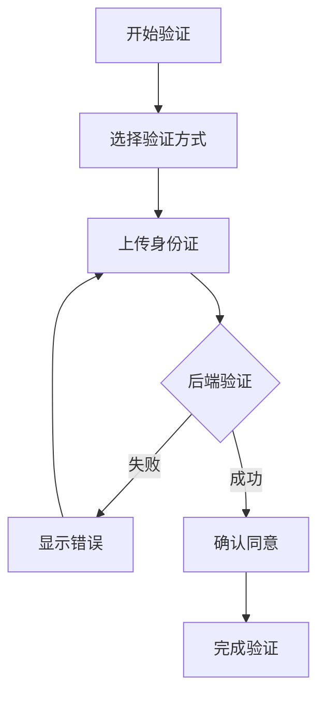
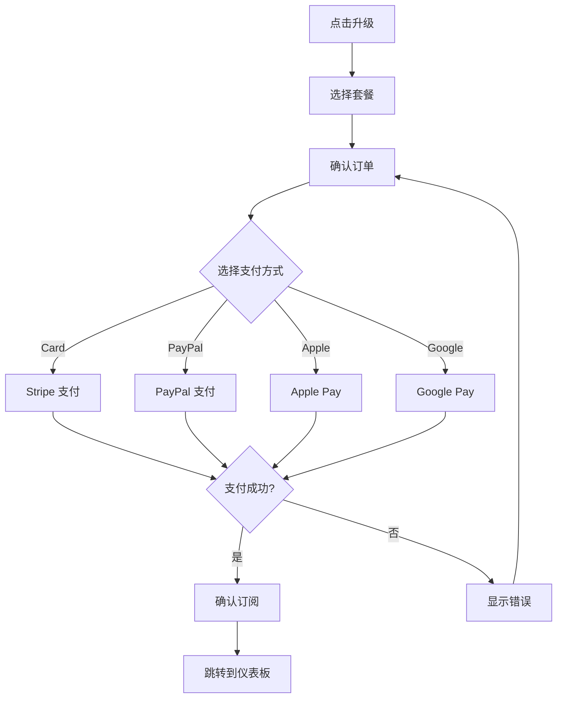

# Phase 3 安全相关 UI/UX 设计方案

**设计时间**: 2026-02-14
**设计师**: UI/UX Designer (ui-ux-designer-3)
**安全工程师**: security-engineer-4
**产品经理**: product-manager-4
**目标平台**: Web (响应式) + Mobile (PWA)
**设计系统**: 基于 design-tokens.ts 和 design-tokens-enhanced.ts

---

## 📋 文档说明

本文档是基于 **Phase 3 最终决策确认 (v3.0)** 的安全相关 UI/UX 设计方案,涵盖所有 P0/P1 安全风险的界面设计方案。

**关联文档**:
- `PHASE3_UI_UX_DESIGN_INTEGRATED.md` - Phase 3 核心 UI/UX 设计 (120h 已完成)
- `PHASE3_SECURITY_RISK_ASSESSMENT.md` - 安全风险评估
- `PHASE3_FINAL_DECISION_CONFIRMATION.md` - 最终决策确认 (v3.0)
- `PHASE3_PRODUCT_REQUIREMENTS_DOCUMENT.md` - 产品需求文档 v2.0

---

## 📊 工作量估算

| 模块 | 工时 | 优先级 | 状态 |
|------|------|--------|------|
| 1. COPPA 合规 UI | 6h | P0 | 本文档 |
| 2. AI 配额管理 UI | 4h | P0 | 本文档 |
| 3. AI 付费墙设计 | 3h | P0 | 本文档 |
| 4. 密码强度增强 | 1h | P1 | 本文档 |
| 5. 其他安全 UI | 2h | P1 | 本文档 |
| **总计** | **16h** | - | **In Progress** |

---

## 目录

1. [模块一: COPPA 合规 UI](#模块一-coppa-合规-ui)
2. [模块二: AI 配额管理 UI](#模块二-ai-配额管理-ui)
3. [模块三: AI 付费墙设计](#模块三-ai-付费墙设计)
4. [模块四: 密码强度增强](#模块四-密码强度增强)
5. [模块五: 其他安全 UI](#模块五-其他安全-ui)
6. [设计系统扩展](#设计系统扩展)
7. [无障碍访问](#无障碍访问)
8. [开发交付清单](#开发交付清单)

---

## 模块一: COPPA 合规 UI

### 设计目标

### 1.1 用户目标

- **父母**: 了解儿童数据如何被保护,提供知情同意
- **合规官**: 满足 COPPA/GDPR/PIPL 法律要求
- **审计**: 可追溯的同意记录和加密状态

### 1.2 业务目标

- **合规**: 满足 COPPA (美国), GDPR (欧盟), PIPL (中国) 要求
- **信任**: 透明展示数据保护措施
- **风险规避**: 避免罚款 ($16K+ per COPPA violation)

### 1.3 法律要求概览

| 法规 | 关键要求 | 违规后果 |
|------|----------|----------|
| **COPPA** (美国) | 13 岁以下需父母可验证同意 | $16,269+ / violation |
| **GDPR** (欧盟) | 生物识别数据需明确依据 | €20M 或 4% 营业额 |
| **PIPL** (中国) | 敏感个人信息需单独同意 | ¥50M 或 5% 营业额 |

---

### 页面结构设计

#### 1.3.1 父母验证流程 (Parent Verification Flow)

##### 页面 1: 数据收集同意页面

```
+---------------------------------------------------------------+
|  Header: 隐私设置与数据保护                          [语言▼]  |
+---------------------------------------------------------------+
|                                                               |
|  +-----------------------------------------------------------+  |
|  |                    🔒 保护儿童隐私                           |  |
|  |                                                           |  |
|  |  我们非常重视您孩子的隐私安全。在使用本服务前，             |  |
|  |  请仔细阅读我们的隐私政策和数据收集说明。                   |  |
|  |                                                           |  |
|  |  ✅ 我们遵守 COPPA、GDPR、PIPL 等法规                       |  |
|  |  ✅ 所有数据采用 AES-256 加密存储                           |  |
|  |  ✅ 您可以随时要求删除所有数据                             |  |
|  |                                                           |  |
|  +-----------------------------------------------------------+  |
|                                                               |
|  +-----------------------------------------------------------+  |
|  |  数据收集清单 (✓ 必须同意)                                  |  |
|  |                                                           |  |
|  |  ☑ 我已阅读并同意收集以下数据:                             |  |
|  |                                                           |  |
|  |  📷 照片数据                                               |  |
|  │  ├─ 照片文件 (加密存储)                                    |  |
|  │  ├─ 拍摄时间                                              |  |
|  │  ├─ 地理位置 (可选)                                       |  |
|  │  └─ 描述文本                                              |  |
|  |                                                           |  |
|  |  👶 成长记录                                               |  |
|  │  ├─ 身高数据 (加密存储)                                    |  |
|  │  ├─ 体重数据 (加密存储)                                    |  |
|  │  └─ 成长曲线                                              |  |
|  |                                                           |  |
|  |  📅 重要日期                                               |  |
|  │  ├─ 生日                                                  |  |
|  │  ├─ 节日                                                  |  |
|  │  └─ 纪念日                                                |  |
|  |                                                           |  |
|  |  🤖 AI 分析 (可选,需额外同意)                              |  |
|  │  ├─ 照片质量评分                                          |  |
|  │  ├─ 智能场景分类                                          |  |
|  │  └─ 自动标签建议                                          |  |
|  |                                                           |  |
|  +-----------------------------------------------------------+  |
|                                                               |
|  +-----------------------------------------------------------+  |
|  |  🔐 父母验证 (Verifiable Parental Consent)                |  |
|  |                                                           |  |
|  |  为确保您是孩子的合法监护人，我们需要验证您的身份。         |  |
|  |                                                           |  |
|  |  验证方式:                                                |  |
|  |  ○ 身份证验证 (推荐)                                      |  |
|  |  ○ 信用卡验证 ($0.10 授权)                                |  |
|  |  ○ 社会安全号 (SSN) 后4位                                 |  |
|  |                                                           |  |
|  |  [开始验证]                                               |  |
|  |                                                           |  |
|  +-----------------------------------------------------------+  |
|                                                               |
|  [详细隐私政策] [数据使用协议] [联系我们]                    |  |
|                                                               |
+---------------------------------------------------------------+
```

**交互流程**:

1. 用户必须勾选"我已阅读并同意收集以下数据"
2. 用户必须选择一种验证方式
3. 点击"开始验证"后跳转到对应验证流程

---

##### 页面 2: 身份证验证流程 (ID Verification)

```
+---------------------------------------------------------------+
|  Header: 父母身份验证                                  [取消]  |
+---------------------------------------------------------------+
|                                                               |
|  进度: [████████░░] 2/4                                      |
|                                                               |
|  +-----------------------------------------------------------+  |
|  |  📱 上传身份证照片                                          |  |
|  |                                                           |  |
|  |  请上传您本人的身份证正反面照片。照片仅用于验证，          |  |
|  |  不会被存储或用于其他目的。                                 |  |
|  |                                                           |  |
|  |  +-------------------------------------------------------+  |  |
|  |  |                                                       |  |  |
|  |  |          [上传身份证正面]                              |  |  |
|  |  |                                                       |  |  |
|  |  |          📸 拍摄或上传文件                              |  |  |
|  |  |                                                       |  |  |
|  |  +-------------------------------------------------------+  |  |
|  |                                                           |  |
|  |  +-------------------------------------------------------+  |  |
|  |  |                                                       |  |  |
|  |  |          [上传身份证反面]                              |  |  |
|  |  |                                                       |  |  |
|  |  |          📸 拍摄或上传文件                              |  |  |
|  |  |                                                       |  |  |
|  |  +-------------------------------------------------------+  |  |
|  |                                                           |  |
|  |  ⚠️ 注意事项:                                            |  |
|  |  • 照片需清晰,文字可读                                    |  |
|  |  • 身份证必须在有效期内                                    |  |
|  |  • 仅限本人身份证                                         |  |
|  |  • 验证完成后照片将立即删除                                |  |
|  |                                                           |  |
|  +-----------------------------------------------------------+  |
|                                                               |
|           [上一步]                          [下一步]           |
|                                                               |
+---------------------------------------------------------------+
```

**验证流程**:

1. **上传** → 前端预览 + OCR 识别
2. **后端验证** → 第三方服务验证 (Stripe Identity / Amazon Rekognition)
3. **活体检测** (可选) → 确保真人操作
4. **验证完成** → 记录验证结果 + 删除身份证照片

**状态反馈**:

```typescript
interface VerificationState {
  step: 'upload' | 'verifying' | 'success' | 'failed'
  frontIdUploaded: boolean
  backIdUploaded: boolean
  verificationId: string
  error?: string
}
```

---

##### 页面 3: 验证成功 / 同意确认页面

```
+---------------------------------------------------------------+
|  Header: 验证成功                                    [关闭]   |
+---------------------------------------------------------------+
|                                                               |
|             ✅                                               |
|             验证成功!                                          |
|                                                               |
|  +-----------------------------------------------------------+  |
|  |  📋 最终确认                                               |  |
|  |                                                           |  |
|  |  您已通过父母身份验证,请确认以下事项:                      |  |
|  |                                                           |  |
|  |  ☑ 我是 [儿童姓名] 的合法监护人                           |  |
|  |  ☑ 我同意收集上述数据                                      |  |
|  |  ☑ 我了解可随时撤销同意                                    |  |
|  |  ☑ 我了解数据将被加密存储                                  |  |
|  |                                                           |  |
|  |  [确认并开始使用]                                         |  |
|  |                                                           |  |
|  +-----------------------------------------------------------+  |
|                                                               |
|  +-----------------------------------------------------------+  |
|  |  📅 验证记录                                               |  |
|  |                                                           |  |
|  |  验证时间: 2026-02-14 14:32:15                            |  |
|  |  验证方式: 身份证验证                                      |  |
|  |  验证 ID: vf_abc123xyz                                    |  |
|  |  有效期: 长期有效 (除非撤销)                               |  |
|  |                                                           |  |
|  +-----------------------------------------------------------+  |
|                                                               |
+---------------------------------------------------------------+
```

**数据存储**:

```typescript
interface ParentalConsent {
  id: string
  childId: string
  parentId: string
  consentType: 'COPPA' | 'GDPR' | 'PIPL'
  verificationMethod: 'ID_CARD' | 'CREDIT_CARD' | 'SSN'
  verifiedAt: Date
  consentData: {
    photoCollection: boolean
    growthDataCollection: boolean
    aiAnalysis: boolean
  }
  ipAddress: string
  userAgent: string
  status: 'ACTIVE' | 'REVOKED'
}
```

---

#### 1.3.2 隐私政策页面 (Privacy Policy Page)

```
+---------------------------------------------------------------+
|  Header: 隐私政策                                      [打印]  |
+---------------------------------------------------------------+
|                                                               |
|  +-----------------------------------------------------------+  |
|  |  🔒 我们如何保护儿童隐私                                    |  |
|  |                                                           |  |
|  |  本应用严格遵守以下法律法规:                               |  |
|  |                                                           |  |
|  |  🇺🇸 COPPA (美国)                                         |  |
|  |  • 13 岁以下儿童需父母可验证同意                           |  |
|  |  • 父母可审查、删除儿童数据                                |  |
|  |  • 违规罚款 $16,269+ / 次                                 |  |
|  |                                                           |  |
|  |  🇪🇺 GDPR (欧盟)                                          |  |
|  |  • 生物识别数据需明确法律依据                              |  |
|  |  • 用户有权访问、删除数据                                  |  |
|  |  • 违规罚款 €20M 或 4% 营业额                             |  |
|  |                                                           |  |
|  |  🇨🇳 PIPL (中国)                                         |  |
|  |  • 敏感个人信息需单独同意                                  |  |
|  |  • 数据本地化存储                                          |  |
|  |  • 违规罚款 ¥50M 或 5% 营业额                             |  |
|  |                                                           |  |
|  +-----------------------------------------------------------+  |
|                                                               |
|  +-----------------------------------------------------------+  |
|  |  📊 数据收集清单                                          |  |
|  |                                                           |  |
|  |  | 数据类别 | 是否收集 | 加密方式 | 保留期限 |        |  |
|  |  |----------|----------|----------|----------|        |  |
|  |  | 照片文件 | ✓ | AES-256 | 账号期内 |        |  |
|  |  | 身高体重 | ✓ | AES-256 | 账号期内 |        |  |
|  |  | 地理位置 | ✓ | AES-256 | 账号期内 |        |  |
|  |  | 人脸特征 | ✗ | - | 不存储 |        |  |
|  |  | 声音特征 | ✗ | - | 不存储 |        |  |
|  |                                                           |  |
|  +-----------------------------------------------------------+  |
|                                                               |
|  +-----------------------------------------------------------+  |
|  |  🔐 加密与安全措施                                        |  |
|  |                                                           |  |
|  |  传输加密: TLS 1.3                                         |  |
|  |  存储加密: AES-256-GCM                                     |  |
|  |  密钥管理: AWS KMS (每年轮换)                              |  |
|  |  访问控制: 仅父母可访问儿童数据                            |  |
|  |                                                           |  |
|  +-----------------------------------------------------------+  |
|                                                               |
|  +-----------------------------------------------------------+  |
|  |  👤 您的权利                                              |  |
|  |                                                           |  |
|  |  ✓ 访问权: 查看我们收集的所有数据                          |  |
|  |  ✓ 删除权: 要求删除所有儿童数据                            |  |
|  |  ✓ 撤销同意: 随时撤回数据收集同意                          |  |
|  |  ✓ 数据导出: 下载所有数据 (JSON/照片)                      |  |
|  |  ✓ 投诉权: 向监管机构投诉                                  |  |
|  |                                                           |  |
|  +-----------------------------------------------------------+  |
|                                                               |
|  [我同意隐私政策] [查看完整法律文档] [联系隐私团队]           |  |
|                                                               |
+---------------------------------------------------------------+
```

---

#### 1.3.3 数据管理页面 (Data Management Page)

```
+---------------------------------------------------------------+
|  Header: 数据管理                                [返回账户设置] |
+---------------------------------------------------------------+
|                                                               |
|  +-----------------------------------------------------------+  |
|  |  🔒 加密状态                                              |  |
|  |                                                           |  |
|  |  所有儿童数据已加密存储:                                   |  |
|  |  • 照片数据: AES-256-GCM 加密                             |  |
|  |  • 成长数据: AES-256-GCM 加密                             |  |
|  |  • 传输层: TLS 1.3 加密                                   |  |
|  |                                                           |  |
|  |  最后加密密钥轮换: 2026-01-15                              |  |
|  |                                                           |  |
|  +-----------------------------------------------------------+  |
|                                                               |
|  +-----------------------------------------------------------+  |
|  |  👶 儿童列表                                              |  |
|  |                                                           |  |
|  |  +-----------------------------------------------------+  |  |
|  |  |  👼 宝宝1                                [管理]     |  |  |
|  |  |  • 234 张照片 (已加密)                               |  |  |
|  |  |  • 12 条成长记录 (已加密)                            |  |  |
|  |  |  • 5 个重要日期                                     |  |  |
|  |  |  • AI 分析: 已启用 (本地处理)                        |  |  |
|  |  |                                                     |  |  |
|  |  +-----------------------------------------------------+  |  |
|  |                                                           |  |
|  |  +-----------------------------------------------------+  |  |
|  |  |  👼 宝宝2                                [管理]     |  |  |
|  |  |  • 156 张照片 (已加密)                               |  |  |
|  |  |  • 8 条成长记录 (已加密)                             |  |  |
|  |  |  • 3 个重要日期                                     |  |  |
|  |  |  • AI 分析: 未启用                                   |  |  |
|  |  |                                                     |  |  |
|  |  +-----------------------------------------------------+  |  |
|  |                                                           |  |
|  +-----------------------------------------------------------+  |
|                                                               |
|  +-----------------------------------------------------------+  |
|  |  🛠️ 批量操作                                             |  |
|  |                                                           |  |
|  |  [导出所有数据] [删除所有数据] [撤销所有同意]             |  |
|  |                                                           |  |
|  +-----------------------------------------------------------+  |
|                                                               |
+---------------------------------------------------------------+
```

**操作确认 (例如删除数据)**:

```
+---------------------------------------------------------------+
|  ⚠️ 删除数据确认                                       [✕]     |
+---------------------------------------------------------------+
|                                                               |
|  您正在请求删除所有儿童数据,此操作不可撤销!                     |  |
|                                                               |
|  以下数据将被永久删除:                                         |  |
|  • 所有照片文件                                                |  |
|  • 所有成长记录                                                |  |
|  • 所有重要日期                                                |  |
|  • 父母验证记录                                               |  |
|  • AI 分析缓存                                                 |  |
|                                                               |
|  为确认此操作,请输入密码:                                      |  |
|  +-------------------------------------------+                |  |
|  | [输入密码........................] |  [显示] |        |  |
|  +-------------------------------------------+                |  |
|                                                               |
|  请输入 "DELETE ALL" 以确认:                                   |  |
|  +-------------------------------------------+                |  |
|  | DELETE ALL ........................ |                |  |
|  +-------------------------------------------+                |  |
|                                                               |
|           [取消]                  [确认删除所有数据]           |  |
|                                                               |
+---------------------------------------------------------------+
```

---

### 组件设计

#### 组件 1.1: `ConsentCheckboxGroup`

**职责**: 复选框组,用于数据收集同意

**Props 接口**:

```typescript
interface ConsentCheckboxGroupProps {
  consentItems: {
    id: string
    label: string
    description?: string
    required: boolean
    defaultChecked?: boolean
  }[]
  onConsentChange: (consents: Record<string, boolean>) => void
  error?: string
}

interface ConsentState {
  photoCollection: boolean
  growthDataCollection: boolean
  aiAnalysis: boolean
  allRequired: boolean
}
```

**状态管理**:

```tsx
export function ConsentCheckboxGroup({
  consentItems,
  onConsentChange,
  error
}: ConsentCheckboxGroupProps) {
  const [consents, setConsents] = useState<Record<string, boolean>>({})

  const handleChange = (id: string, checked: boolean) => {
    const newConsents = { ...consents, [id]: checked }
    setConsents(newConsents)
    onConsentChange(newConsents)
  }

  const allRequiredChecked = consentItems
    .filter(item => item.required)
    .every(item => consents[item.id])

  return (
    <div className="space-y-4">
      {consentItems.map(item => (
        <div key={item.id} className="flex items-start">
          <input
            type="checkbox"
            id={item.id}
            checked={consents[item.id] || false}
            onChange={e => handleChange(item.id, e.target.checked)}
            className="mt-1"
          />
          <label htmlFor={item.id} className="ml-3">
            <span className="font-medium">
              {item.label}
              {item.required && <span className="text-red-500"> *</span>}
            </span>
            {item.description && (
              <p className="text-sm text-gray-600">{item.description}</p>
            )}
          </label>
        </div>
      ))}
      {error && (
        <p className="text-red-600 text-sm" role="alert">
          {error}
        </p>
      )}
    </div>
  )
}
```

**样式要点**:

- 使用 Tailwind CSS
- 必填项用红色星号标识
- 错误提示用 `role="alert"` 屏幕阅读器友好
- 清晰的视觉层次

**A11y 要点**:

- 使用 `<label>` + `for` 关联
- `aria-required="true"` 标识必填项
- 错误提示使用 `role="alert"` + `aria-live="polite"`

---

#### 组件 1.2: `ParentVerificationWizard`

**职责**: 多步骤向导,处理父母验证流程

**Props 接口**:

```typescript
interface VerificationStep {
  id: string
  title: string
  component: React.ComponentType
  validate?: () => boolean | Promise<boolean>
}

interface ParentVerificationWizardProps {
  steps: VerificationStep[]
  onComplete: (data: VerificationData) => void
  onCancel: () => void
}

interface VerificationData {
  method: 'ID_CARD' | 'CREDIT_CARD' | 'SSN'
  idFrontUrl?: string
  idBackUrl?: string
  ssnLast4?: string
  consentConfirmed: boolean
}
```

**状态管理**:

```tsx
export function ParentVerificationWizard({
  steps,
  onComplete,
  onCancel
}: ParentVerificationWizardProps) {
  const [currentStep, setCurrentStep] = useState(0)
  const [data, setData] = useState<VerificationData>({})
  const [isValid, setIsValid] = useState(false)
  const [isLoading, setIsLoading] = useState(false)

  const handleNext = async () => {
    const step = steps[currentStep]
    if (step.validate) {
      setIsLoading(true)
      const valid = await step.validate()
      setIsLoading(false)
      if (!valid) return
    }
    if (currentStep < steps.length - 1) {
      setCurrentStep(currentStep + 1)
    } else {
      onComplete(data)
    }
  }

  const handleBack = () => {
    if (currentStep > 0) {
      setCurrentStep(currentStep - 1)
    }
  }

  return (
    <div className="wizard">
      <div className="progress-bar">
        {steps.map((step, index) => (
          <div
            key={step.id}
            className={`step ${index === currentStep ? 'active' : ''} ${
              index < currentStep ? 'completed' : ''
            }`}
          >
            {step.title}
          </div>
        ))}
      </div>

      <div className="step-content">
        <steps[currentStep].component
          data={data}
          onDataChange={setData}
          onValidChange={setIsValid}
        />
      </div>

      <div className="wizard-actions">
        <button onClick={onCancel}>取消</button>
        {currentStep > 0 && <button onClick={handleBack}>上一步</button>}
        <button
          onClick={handleNext}
          disabled={!isValid || isLoading}
        >
          {isLoading ? '验证中...' : currentStep === steps.length - 1 ? '完成' : '下一步'}
        </button>
      </div>
    </div>
  )
}
```

**交互流程**:



---

#### 组件 1.3: `DataEncryptionStatusBadge`

**职责**: 显示数据加密状态

**Props 接口**:

```typescript
interface EncryptionStatus {
  encrypted: boolean
  algorithm?: 'AES-256-GCM' | 'AES-256-CBC'
  lastKeyRotation?: Date
}

interface DataEncryptionStatusBadgeProps {
  status: EncryptionStatus
  onManageKeys?: () => void
}
```

**组件实现**:

```tsx
export function DataEncryptionStatusBadge({
  status,
  onManageKeys
}: DataEncryptionStatusBadgeProps) {
  return (
    <div className="encryption-status">
      {status.encrypted ? (
        <div className="badge badge-success">
          <svg className="icon-lock" />
          <span>已加密 ({status.algorithm})</span>
          {status.lastKeyRotation && (
            <span className="text-xs">
              密钥轮换: {formatDate(status.lastKeyRotation)}
            </span>
          )}
        </div>
      ) : (
        <div className="badge badge-warning">
          <svg className="icon-unlock" />
          <span>未加密</span>
        </div>
      )}
      {onManageKeys && (
        <button onClick={onManageKeys} className="btn-link">
          管理加密密钥
        </button>
      )}
    </div>
  )
}
```

**样式要点**:

- 绿色徽章: 已加密 (成功)
- 黄色徽章: 未加密 (警告)
- 锁图标 SVG
- Hover 显示密钥轮换时间

---

## 模块二: AI 配额管理 UI

### 设计目标

### 2.1 用户目标

- **免费用户**: 了解 AI 使用额度,避免超限
- **付费用户**: 监控使用量,管理订阅
- **管理员**: 监控整体 AI 成本,防止超支

### 2.2 业务目标

- **成本控制**: AI API 成本不超过 $500/月
- **收入增长**: 引导免费用户升级付费
- **透明度**: 清晰展示配额和使用情况

### 2.3 配额规则

| 用户类型 | AI 分析配额 | 成长报告 | 价格 |
|---------|-----------|---------|------|
| **免费** | 10 张/月 | 1 次/月 | $0 |
| **付费** | 100 张/月 | 无限 | $10/月 |
| **按量** | $0.01/张 | - | - |

---

### 页面结构设计

#### 2.3.1 AI 配额概览页面

```
+---------------------------------------------------------------+
|  Header: AI 功能配额                                    [升级]  |
+---------------------------------------------------------------+
|                                                               |
|  +-----------------------------------------------------------+  |
|  |  💎 当前计划: 免费用户                                   |  |
|  |                                                           |  |
|  |  本月配额使用情况:                                        |  |
|  |                                                           |  |
|  |  ┌─────────────────────────────────────────┐             |  |
|  |  │ 照片质量评分: 7/10 张 ████████░░ 70%      │             |  |
|  |  └─────────────────────────────────────────┘             |  |
|  |                                                           |  |
|  |  ┌─────────────────────────────────────────┐             |  |
|  |  │ 智能场景分类: 5/10 张 ██████░░░░░ 50%      │             |  |
|  |  └─────────────────────────────────────────┘             |  |
|  |                                                           |  |
|  |  ┌─────────────────────────────────────────┐             |  |
|  |  │ 自动标签建议: 3/10 张 ███░░░░░░░░ 30%      │             |  |
|  |  └─────────────────────────────────────────┘             |  |
|  |                                                           |  |
|  |  剩余配额: 10 次 (3 个功能共享)                          |  |
|  |  重置时间: 2026-03-01 (还有 14 天)                       |  |
|  |                                                           |  |
|  +-----------------------------------------------------------+  |
|                                                               |
|  +-----------------------------------------------------------+  |
|  |  📊 计划对比                                              |  |
|  |                                                           |  |
|  |  | 功能 | 免费版 | 付费版 |                    |  |
|  |  |------|--------|--------|                    |  |
|  |  | AI 分析配额 | 10 张/月 | 100 张/月 |           |  |
|  |  | 成长报告 | 1 次/月 | 无限 |                |  |
|  |  | 高级筛选 | ✗ | ✓ |                        |  |
|  |  | 批量处理 | ✗ | ✓ |                        |  |
|  |  | 价格 | $0 | $10/月 |                 |  |
|  |                                                           |  |
|  +-----------------------------------------------------------+  |
|                                                               |
|           [查看使用详情]              [升级到付费版]           |
|                                                               |
+---------------------------------------------------------------+
```

**进度条组件**:

```tsx
interface QuotaProgressBarProps {
  used: number
  total: number
  label: string
  warningThreshold?: number // 默认 80%
}

export function QuotaProgressBar({
  used,
  total,
  label,
  warningThreshold = 0.8
}: QuotaProgressBarProps) {
  const percentage = Math.min((used / total) * 100, 100)
  const isNearLimit = percentage >= warningThreshold * 100

  return (
    <div className="quota-progress">
      <div className="quota-label">
        <span>{label}</span>
        <span>
          {used}/{total} 张 ({percentage.toFixed(0)}%)
        </span>
      </div>
      <div className="progress-bar">
        <div
          className={`progress-fill ${
            isNearLimit ? 'bg-warning' : 'bg-primary'
          }`}
          style={{ width: `${percentage}%` }}
          role="progressbar"
          aria-valuenow={used}
          aria-valuemin={0}
          aria-valuemax={total}
        />
      </div>
      {isNearLimit && (
        <p className="text-warning text-sm">
          ⚠️ 即将达到配额上限,升级付费版获得更多额度
        </p>
      )}
    </div>
  )
}
```

---

#### 2.3.2 配额超限提示 (Quota Exceeded Modal)

```
+---------------------------------------------------------------+
|  ⚠️ AI 配额已达上限                                    [✕]     |
+---------------------------------------------------------------+
|                                                               |
|  您本月的 AI 分析配额已用完 (10/10 张)                          |  |
|                                                               |
|  +-----------------------------------------------------------+  |
|  |  💡 升级到付费版,享受更多权益:                            |  |
|  |                                                           |  |
|  |  ✓ 100 张/月 AI 分析配额                                  |  |
|  |  ✓ 无限成长报告                                           |  |
|  |  ✓ 优先客户支持                                           |  |
|  |  ✓ 高级筛选和批量处理                                     |  |
|  |                                                           |  |
|  |  仅需 $10/月,随时可取消                                   |  |
|  |                                                           |  |
|  +-----------------------------------------------------------+  |
|                                                               |
|  或者:                                                       |  |
|  • 等待下月配额重置 (还有 14 天)                              |  |
|  • 按量付费 $0.01/张                                         |  |
|                                                               |
|           [稍后提醒]                    [立即升级 $10/月]       |
|                                                               |
+---------------------------------------------------------------+
```

**触发时机**:

1. 用户点击 AI 功能按钮时,检测配额
2. 如果 `used >= total`,显示 Modal
3. 提供"升级"、"按量付费"、"等待重置"三个选项

---

#### 2.3.3 使用历史页面 (Usage History)

```
+---------------------------------------------------------------+
|  Header: AI 使用历史                                  [返回]   |
+---------------------------------------------------------------+
|                                                               |
|  筛选: [本月▼] [功能: 全部▼]                                   |
|                                                               |
|  +-----------------------------------------------------------+  |
|  |  📅 本月使用统计 (2026-02-01 ~ 2026-02-14)                |  |
|  |                                                           |  |
|  |  总使用: 15 次 | 总成本: $0.15                           |  |
|  |                                                           |  |
|  |  2026-02-14 14:32: 照片质量评分 (1 张)                   |  |
|  |  2026-02-13 09:15: 智能场景分类 (3 张)                   |  |
|  |  2026-02-12 18:45: 照片质量评分 (2 张)                   |  |
|  |  2026-02-10 11:20: 自动标签建议 (5 张)                  |  |
|  |  ...                                                     |  |
|  |                                                           |  |
|  +-----------------------------------------------------------+  |
|                                                               |
|  [导出使用记录] [联系客服]                                     |  |
|                                                               |
+---------------------------------------------------------------+
```

**API 接口**:

```typescript
interface UsageRecord {
  id: string
  userId: string
  aiFeature: 'QUALITY_SCORE' | 'SCENE_CLASSIFICATION' | 'AUTO_TAG'
  photoCount: number
  cost: number // USD
  createdAt: Date
}

interface UsageHistoryResponse {
  totalUsage: number
  totalCost: number
  records: UsageRecord[]
  quota: {
    used: number
    total: number
    resetDate: Date
  }
}
```

---

### 组件设计

#### 组件 2.1: `AIQuotaCard`

**职责**: 显示 AI 配额概览卡片

**Props 接口**:

```typescript
interface QuotaInfo {
  feature: 'QUALITY_SCORE' | 'SCENE_CLASSIFICATION' | 'AUTO_TAG'
  used: number
  total: number
  resetDate: Date
}

interface AIQuotaCardProps {
  quota: QuotaInfo
  onUpgrade: () => void
}
```

**组件实现**:

```tsx
export function AIQuotaCard({ quota, onUpgrade }: AIQuotaCardProps) {
  const remaining = quota.total - quota.used
  const percentage = (quota.used / quota.total) * 100
  const isNearLimit = percentage >= 80

  return (
    <div className="quota-card">
      <div className="quota-header">
        <h3>{getFeatureLabel(quota.feature)}</h3>
        <span className={`badge ${isNearLimit ? 'badge-warning' : 'badge-success'}`}>
          {remaining}/{quota.total} 张剩余
        </span>
      </div>

      <QuotaProgressBar
        used={quota.used}
        total={quota.total}
        label={getFeatureLabel(quota.feature)}
        warningThreshold={0.8}
      />

      <div className="quota-footer">
        <p className="text-sm text-gray-600">
          重置时间: {formatDate(quota.resetDate)}
        </p>
        {isNearLimit && (
          <button onClick={onUpgrade} className="btn-primary">
            升级到付费版
          </button>
        )}
      </div>
    </div>
  )
}
```

---

#### 组件 2.2: `QuotaExceededModal`

**职责**: 配额超限提示弹窗

**Props 接口**:

```typescript
interface QuotaExceededModalProps {
  feature: string
  quotaUsed: number
  quotaTotal: number
  resetDate: Date
  onUpgrade: () => void
  onPayPerUse: () => void
  onClose: () => void
}
```

**组件实现**:

```tsx
export function QuotaExceededModal({
  feature,
  quotaUsed,
  quotaTotal,
  resetDate,
  onUpgrade,
  onPayPerUse,
  onClose
}: QuotaExceededModalProps) {
  const daysUntilReset = Math.ceil(
    (resetDate.getTime() - Date.now()) / (1000 * 60 * 60 * 24)
  )

  return (
    <Modal onClose={onClose} className="quota-exceeded-modal">
      <div className="modal-header">
        <h2>⚠️ {feature} 配额已达上限</h2>
      </div>

      <div className="modal-body">
        <p>
          您本月的 {feature} 配额已用完 ({quotaUsed}/{quotaTotal} 张)
        </p>

        <div className="upgrade-pitch">
          <h3>💡 升级到付费版,享受更多权益:</h3>
          <ul>
            <li>✓ 100 张/月 AI 分析配额</li>
            <li>✓ 无限成长报告</li>
            <li>✓ 优先客户支持</li>
            <li>✓ 高级筛选和批量处理</li>
          </ul>
          <p className="price">仅需 $10/月,随时可取消</p>
        </div>

        <div className="alternatives">
          <p>或者:</p>
          <ul>
            <li>等待下月配额重置 (还有 {daysUntilReset} 天)</li>
            <li>按量付费 $0.01/张</li>
          </ul>
        </div>
      </div>

      <div className="modal-actions">
        <button onClick={onClose} className="btn-secondary">
          稍后提醒
        </button>
        <button onClick={onPayPerUse} className="btn-tertiary">
          按量付费 $0.01/张
        </button>
        <button onClick={onUpgrade} className="btn-primary">
          立即升级 $10/月
        </button>
      </div>
    </Modal>
  )
}
```

**交互流程**:

1. 用户触发 AI 功能
2. 前端检查配额 `used >= total`
3. 如果超限,显示 Modal
4. 用户选择:
   - 升级 → 跳转到付费页面
   - 按量付费 → 触发单次支付流程
   - 稍后提醒 → 关闭 Modal,记录提醒时间

---

#### 组件 2.3: `UsageHistoryList`

**职责**: 显示 AI 使用历史记录

**Props 接口**:

```typescript
interface UsageHistoryListProps {
  records: UsageRecord[]
  totalUsage: number
  totalCost: number
  onExport: () => void
}
```

**组件实现**:

```tsx
export function UsageHistoryList({
  records,
  totalUsage,
  totalCost,
  onExport
}: UsageHistoryListProps) {
  return (
    <div className="usage-history">
      <div className="history-header">
        <h3>使用记录</h3>
        <button onClick={onExport} className="btn-link">
          导出使用记录
        </button>
      </div>

      <div className="history-summary">
        <p>总使用: {totalUsage} 次</p>
        <p>总成本: ${totalCost.toFixed(2)}</p>
      </div>

      <ul className="history-list">
        {records.map(record => (
          <li key={record.id} className="history-item">
            <div className="item-time">
              {formatDateTime(record.createdAt)}
            </div>
            <div className="item-feature">
              {getFeatureLabel(record.aiFeature)}
            </div>
            <div className="item-count">
              {record.photoCount} 张
            </div>
            <div className="item-cost">
              ${record.cost.toFixed(2)}
            </div>
          </li>
        ))}
      </ul>
    </div>
  )
}
```

---

## 模块三: AI 付费墙设计

### 设计目标

### 3.1 用户目标

- **免费用户**: 了解付费功能价值,决定是否升级
- **付费用户**: 管理订阅,查看续费状态
- **管理员**: 监控订阅转化率,优化定价

### 3.2 业务目标

- **收入增长**: 实现 $380/月收入 (1000 用户,10% 付费率)
- **转化率提升**: 目标 10% 免费用户升级付费
- **用户留存**: 降低订阅取消率

### 3.3 定价策略

| 功能 | 价格 | 目标付费率 | 月收入 (1000 用户) |
|------|------|-----------|-------------------|
| AI 照片质量评分 | $5/月 | 5% | $250/月 |
| AI 智能场景分类 | $3/月 | 3% | $90/月 |
| AI 自动标签建议 | $2/月 | 2% | $40/月 |
| **捆绑套餐** | $10/月 | 10% | $1000/月 |

---

### 页面结构设计

#### 3.3.1 付费功能介绍页面 (Premium Features Page)

```
+---------------------------------------------------------------+
|  Header: 解锁高级功能                                 [✕]     |
+---------------------------------------------------------------+
|                                                               |
|  +-----------------------------------------------------------+  |
|  |  💎 付费功能 - 让相册管理更智能                            |  |
|  |                                                           |  |
|  |  升级到付费版,解锁以下强大功能:                           |  |
|  |                                                           |  |
|  |  +-----------------------------------------------------+  |  |
|  |  |  📸 AI 照片质量评分 ($5/月)                          |  |  |
|  |  |  • 自动识别最佳照片,节省筛选时间                    |  |  |
|  |  |  • 多维度质量分析 (清晰度/光线/构图)                |  |  |
|  |  |  • 一键精选本月最佳 10 张                          |  |  |
|  |  |  • 每月最多 100 张分析                             |  |  |
|  |  |  [查看演示]                                       |  |  |
|  |  +-----------------------------------------------------+  |  |
|  |                                                           |  |
|  |  +-----------------------------------------------------+  |  |
|  |  |  🎨 AI 智能场景分类 ($3/月)                          |  |  |
|  |  |  • 自动识别: 生日/节日/旅行/日常等场景              |  |  |
|  |  |  • 智能推荐场景相册                                |  |  |
|  |  |  • 本地 AI 处理,保护隐私                           |  |  |
|  |  |  • 每月最多 100 张分析                             |  |  |
|  |  |  [查看演示]                                       |  |  |
|  |  +-----------------------------------------------------+  |  |
|  |                                                           |  |
|  |  +-----------------------------------------------------+  |  |
|  |  |  🏷️ AI 自动标签建议 ($2/月)                         |  |  |
|  |  |  • 智能识别人物、地点、物品                        |  |  |
|  |  |  • 自动生成照片标签                                |  |  |
|  |  |  • 便于快速搜索和筛选                              |  |  |
|  |  |  • 每月最多 100 张分析                             |  |  |
|  |  |  [查看演示]                                       |  |  |
|  |  +-----------------------------------------------------+  |  |
|  |                                                           |  |
|  +-----------------------------------------------------------+  |
|                                                               |
|  +-----------------------------------------------------------+  |
|  |  💰 套餐优惠                                             |  |
|  |                                                           |  |
|  |  ✨ 全功能套餐 - $10/月 (省 $5)                          |  |
|  |  包含以上所有功能 + 无限成长报告 + 优先支持              |  |
|  |                                                           |  |
|  +-----------------------------------------------------------+  |
|                                                               |
|           [暂时跳过]                    [立即升级 $10/月]       |
|                                                               |
+---------------------------------------------------------------+
```

---

#### 3.3.2 支付页面 (Checkout Page)

```
+---------------------------------------------------------------+
|  Header: 确认订阅                                    [返回]   |
+---------------------------------------------------------------+
|                                                               |
|  +-----------------------------------------------------------+  |
|  |  订单摘要                                                |  |
|  |                                                           |  |
|  |  套餐: 全功能套餐 (AI 全功能 + 无限成长报告)             |  |
|  |                                                           |  |
|  |  +-----------------------------------------------------+  |  |
|  |  |  AI 照片质量评分                                    |  |  |
|  |  |  AI 智能场景分类                                    |  |  |
|  |  |  AI 自动标签建议                                    |  |  |
|  |  |  无限成长报告                                       |  |  |
|  |  +-----------------------------------------------------+  |  |
|  |                                                           |  |
|  |  订阅周期: 月付                                          |  |
|  |  价格: $10/月                                            |  |
|  |                                                           |  |
|  +-----------------------------------------------------------+  |
|                                                               |
|  +-----------------------------------------------------------+  |
|  |  💳 支付方式                                             |  |
|  |                                                           |  |
|  |  ○ 信用卡/借记卡                                        |  |
|  |  ○ PayPal                                                |  |
|  |  ○ Apple Pay                                            |  |
|  |  ○ Google Pay                                           |  |
|  |                                                           |  |
|  +-----------------------------------------------------------+  |
|                                                               |
|  +-----------------------------------------------------------+  |
|  |  优惠券代码                                              |  |
|  |  +-------------------------------------------+          |  |
|  |  | [输入代码...]                    | [应用] |  |  |
|  |  +-------------------------------------------+          |  |
|  |                                                           |  |
|  +-----------------------------------------------------------+  |
|                                                               |
|  +-----------------------------------------------------------+  |
|  |  💡 订阅说明                                             |  |
|  |                                                           |  |
|  |  • 订阅立即生效                                           |  |
|  |  • 可随时取消,下月生效                                    |  |
|  |  • 支持 30 天退款保证                                     |  |
|  |                                                           |  |
|  +-----------------------------------------------------------+  |
|                                                               |
|           [取消]                          [确认支付 $10/月]     |
|                                                               |
+---------------------------------------------------------------+
```

**支付流程**:



---

#### 3.3.3 订阅管理页面 (Subscription Management)

```
+---------------------------------------------------------------+
|  Header: 订阅管理                                      [保存]   |
+---------------------------------------------------------------+
|                                                               |
|  +-----------------------------------------------------------+  |
|  |  💎 当前订阅: 全功能套餐                                |  |
|  |                                                           |  |
|  |  状态: ✓ 活跃                                            |  |
|  |  开始时间: 2026-01-15                                     |  |
|  |  下次续费: 2026-02-15 (明天)                              |  |
|  |  价格: $10/月                                             |  |
|  |                                                           |  |
|  +-----------------------------------------------------------+  |
|                                                               |
|  +-----------------------------------------------------------+  |
|  |  💳 支付方式                                             |  |
|  |                                                           |  |
|  |  •••• 4242 (Visa) [默认] [编辑] [删除]                   |  |
|  |  + [添加新支付方式]                                      |  |
|  |                                                           |  |
|  +-----------------------------------------------------------+  |
|                                                               |
|  +-----------------------------------------------------------+  |
|  |  📅 计费周期                                             |  |
|  |                                                           |  |
|  |  当前: 月付 ($10/月)                                     |  |
|  |  ○ 月付 ($10/月)                                        |  |
|  |  ○ 年付 ($100/年, 省 $20)                               |  |
|  |                                                           |  |
|  +-----------------------------------------------------------+  |
|                                                               |
|  +-----------------------------------------------------------+  |
|  |  ⚠️ 取消订阅                                            |  |
|  |                                                           |  |
|  |  取消后,订阅将在本周期结束后停止 (2026-02-15)。          |  |
|  |  您仍可使用至该日期。                                     |  |
|  |                                                           |  |
|  |  [取消订阅]                                             |  |
|  |                                                           |  |
|  +-----------------------------------------------------------+  |
|                                                               |
+---------------------------------------------------------------+
```

**取消订阅确认**:

```
+---------------------------------------------------------------+
|  ⚠️ 取消订阅确认                                      [✕]     |
+---------------------------------------------------------------+
|                                                               |
|  您确定要取消订阅吗?                                           |  |
|                                                               |
|  取消后,您将失去以下功能:                                     |  |
|  • AI 照片质量评分                                            |  |
|  • AI 智能场景分类                                            |  |
|  • AI 自动标签建议                                            |  |
|  • 无限成长报告                                               |  |
|                                                               |
|  订阅将在 2026-02-15 停止,在此之前您仍可使用所有功能。        |  |
|                                                               |
|  为何考虑取消? (帮助我们改进)                                 |  |
|  ○ 功能不够丰富                                              |  |
|  ○ 价格太高                                                  |  |
|  ○ 不常使用                                                  |  |
|  ○ 切换到其他服务                                            |  |
|  ○ 其他                                                     |  |
|                                                               |
|  为挽留您,我们提供:                                            |  |
|  • 9 折优惠 1 个月 ($9/月)                                    |  |
|  • 暂停订阅 (保留账号,停止计费)                                |  |
|                                                               |
|           [暂时保留订阅]              [仍要取消]               |  |
|                                                               |
+---------------------------------------------------------------+
```

---

### 组件设计

#### 组件 3.1: `PremiumFeatureCard`

**职责**: 付费功能卡片展示

**Props 接口**:

```typescript
interface PremiumFeature {
  id: string
  name: string
  description: string
  price: number
  icon: string
  benefits: string[]
  demoVideo?: string
}

interface PremiumFeatureCardProps {
  feature: PremiumFeature
  onUpgrade: () => void
}
```

**组件实现**:

```tsx
export function PremiumFeatureCard({
  feature,
  onUpgrade
}: PremiumFeatureCardProps) {
  return (
    <div className="feature-card">
      <div className="card-header">
        <div className="icon">{feature.icon}</div>
        <h3>{feature.name}</h3>
        <span className="price">${feature.price}/月</span>
      </div>

      <p className="description">{feature.description}</p>

      <ul className="benefits">
        {feature.benefits.map((benefit, index) => (
          <li key={index}>
            <span className="icon-check">✓</span>
            {benefit}
          </li>
        ))}
      </ul>

      {feature.demoVideo && (
        <button className="btn-link">查看演示</button>
      )}

      <button onClick={onUpgrade} className="btn-primary">
        立即升级
      </button>
    </div>
  )
}
```

---

#### 组件 3.2: `CheckoutForm`

**职责**: 支付表单

**Props 接口**:

```typescript
interface CheckoutFormData {
  planId: string
  paymentMethod: 'CARD' | 'PAYPAL' | 'APPLE_PAY' | 'GOOGLE_PAY'
  billingCycle: 'MONTHLY' | 'YEARLY'
  couponCode?: string
}

interface CheckoutFormProps {
  plan: PremiumPlan
  onSubmit: (data: CheckoutFormData) => Promise<void>
}
```

**组件实现**:

```tsx
export function CheckoutForm({ plan, onSubmit }: CheckoutFormProps) {
  const [paymentMethod, setPaymentMethod] = useState<'CARD' | 'PAYPAL'>('CARD')
  const [billingCycle, setBillingCycle] = useState<'MONTHLY' | 'YEARLY'>('MONTHLY')
  const [couponCode, setCouponCode] = useState('')
  const [isProcessing, setIsProcessing] = useState(false)
  const [error, setError] = useState<string>()

  const handleSubmit = async (e: FormEvent) => {
    e.preventDefault()
    setIsProcessing(true)
    setError(undefined)

    try {
      await onSubmit({
        planId: plan.id,
        paymentMethod,
        billingCycle,
        couponCode: couponCode || undefined
      })
    } catch (err) {
      setError(err instanceof Error ? err.message : '支付失败')
    } finally {
      setIsProcessing(false)
    }
  }

  return (
    <form onSubmit={handleSubmit} className="checkout-form">
      <div className="order-summary">
        <h3>订单摘要</h3>
        <p>套餐: {plan.name}</p>
        <ul>
          {plan.features.map(feature => (
            <li key={feature}>{feature}</li>
          ))}
        </ul>
        <p>订阅周期: {billingCycle === 'MONTHLY' ? '月付' : '年付'}</p>
        <p className="total">
          ${billingCycle === 'MONTHLY' ? plan.priceMonthly : plan.priceYearly}
          /{billingCycle === 'MONTHLY' ? '月' : '年'}
        </p>
      </div>

      <div className="payment-method">
        <h3>支付方式</h3>
        <div className="payment-options">
          <label>
            <input
              type="radio"
              name="paymentMethod"
              value="CARD"
              checked={paymentMethod === 'CARD'}
              onChange={e => setPaymentMethod(e.target.value as 'CARD')}
            />
            信用卡/借记卡
          </label>
          <label>
            <input
              type="radio"
              name="paymentMethod"
              value="PAYPAL"
              checked={paymentMethod === 'PAYPAL'}
              onChange={e => setPaymentMethod(e.target.value as 'PAYPAL')}
            />
            PayPal
          </label>
        </div>
      </div>

      <div className="coupon">
        <label htmlFor="coupon">优惠券代码</label>
        <input
          id="coupon"
          type="text"
          value={couponCode}
          onChange={e => setCouponCode(e.target.value)}
          placeholder="输入代码"
        />
      </div>

      {error && (
        <div className="alert alert-error" role="alert">
          {error}
        </div>
      )}

      <div className="subscription-terms">
        <h3>订阅说明</h3>
        <ul>
          <li>订阅立即生效</li>
          <li>可随时取消,下月生效</li>
          <li>支持 30 天退款保证</li>
        </ul>
      </div>

      <div className="form-actions">
        <button type="button" className="btn-secondary">
          取消
        </button>
        <button type="submit" className="btn-primary" disabled={isProcessing}>
          {isProcessing ? '处理中...' : `确认支付 $${plan.priceMonthly}/月`}
        </button>
      </div>
    </form>
  )
}
```

---

## 模块四: 密码强度增强

### 设计目标

### 4.1 安全要求

- **最低长度**: 8 位字符 (原 4-6 位数字)
- **复杂度要求**: 必须包含字母和数字
- **错误锁定**: 5 次错误后锁定 30 分钟

### 4.2 用户体验目标

- **清晰反馈**: 实时显示密码强度
- **引导提示**: 告知用户如何设置强密码
- **错误提示**: 明确的错误原因

---

### 组件设计

#### 组件 4.1: `PasswordStrengthIndicator`

**职责**: 密码强度指示器

**Props 接口**:

```typescript
interface PasswordStrength {
  level: 'WEAK' | 'FAIR' | 'GOOD' | 'STRONG'
  score: number // 0-100
  feedback: string[]
}

interface PasswordStrengthIndicatorProps {
  password: string
}

function calculatePasswordStrength(password: string): PasswordStrength {
  let score = 0
  const feedback: string[] = []

  // 长度检查
  if (password.length >= 8) score += 25
  else feedback.push('至少 8 位字符')

  // 复杂度检查
  const hasLetter = /[a-zA-Z]/.test(password)
  const hasNumber = /[0-9]/.test(password)
  const hasSpecial = /[^a-zA-Z0-9]/.test(password)

  if (hasLetter) score += 25
  else feedback.push('包含字母')

  if (hasNumber) score += 25
  else feedback.push('包含数字')

  if (hasSpecial) score += 25

  // 判断强度等级
  let level: PasswordStrength['level']
  if (score < 50) level = 'WEAK'
  else if (score < 75) level = 'FAIR'
  else if (score < 100) level = 'GOOD'
  else level = 'STRONG'

  return { level, score, feedback }
}
```

**组件实现**:

```tsx
export function PasswordStrengthIndicator({ password }: PasswordStrengthIndicatorProps) {
  const strength = calculatePasswordStrength(password)
  const { level, score, feedback } = strength

  const levelConfig = {
    WEAK: { color: 'bg-red-500', label: '弱', icon: '🔴' },
    FAIR: { color: 'bg-yellow-500', label: '一般', icon: '🟡' },
    GOOD: { color: 'bg-blue-500', label: '良好', icon: '🔵' },
    STRONG: { color: 'bg-green-500', label: '强', icon: '🟢' }
  }

  const config = levelConfig[level]

  return (
    <div className="password-strength">
      <div className="strength-header">
        <span>密码强度:</span>
        <span className={config.color}>
          {config.icon} {config.label}
        </span>
      </div>

      <div className="strength-bar">
        <div
          className={`strength-fill ${config.color}`}
          style={{ width: `${score}%` }}
          role="progressbar"
          aria-valuenow={score}
          aria-valuemin={0}
          aria-valuemax={100}
        />
      </div>

      {feedback.length > 0 && (
        <ul className="strength-feedback">
          {feedback.map((item, index) => (
            <li key={index}>{item}</li>
          ))}
        </ul>
      )}
    </div>
  )
}
```

---

#### 组件 4.2: `SecurePasswordField`

**职责**: 安全密码输入框 (带显示/隐藏)

**Props 接口**:

```typescript
interface SecurePasswordFieldProps {
  label: string
  value: string
  onChange: (value: string) => void
  minLength?: number
  required?: boolean
  error?: string
  showStrengthIndicator?: boolean
}

interface SecurePasswordFieldState {
  isVisible: boolean
  isFocused: boolean
}
```

**组件实现**:

```tsx
export function SecurePasswordField({
  label,
  value,
  onChange,
  minLength = 8,
  required = false,
  error,
  showStrengthIndicator = true
}: SecurePasswordFieldProps) {
  const [isVisible, setIsVisible] = useState(false)
  const [isFocused, setIsFocused] = useState(false)

  const strength = calculatePasswordStrength(value)

  return (
    <div className="password-field">
      <label htmlFor={label}>
        {label}
        {required && <span className="required">*</span>}
      </label>

      <div className={`input-group ${isFocused ? 'focused' : ''} ${error ? 'error' : ''}`}>
        <input
          id={label}
          type={isVisible ? 'text' : 'password'}
          value={value}
          onChange={e => onChange(e.target.value)}
          onFocus={() => setIsFocused(true)}
          onBlur={() => setIsFocused(false)}
          minLength={minLength}
          required={required}
          aria-invalid={!!error}
          aria-describedby={error ? `${label}-error` : undefined}
        />
        <button
          type="button"
          onClick={() => setIsVisible(!isVisible)}
          aria-label={isVisible ? '隐藏密码' : '显示密码'}
          className="toggle-visibility"
        >
          {isVisible ? '👁️' : '👁️‍🗨️'}
        </button>
      </div>

      {showStrengthIndicator && value.length > 0 && (
        <PasswordStrengthIndicator password={value} />
      )}

      {error && (
        <p id={`${label}-error`} className="error-message" role="alert">
          {error}
        </p>
      )}
    </div>
  )
}
```

---

## 模块五: 其他安全 UI

### 5.1 隐私设置页面

```
+---------------------------------------------------------------+
|  Header: 隐私设置                                      [保存]   |
+---------------------------------------------------------------+
|                                                               |
|  +-----------------------------------------------------------+  |
|  |  🔐 数据隐私                                              |  |
|  |                                                           |  |
|  |  ☑ 加密所有照片数据                                        |  |
|  |  ☑ 加密所有成长数据                                        |  |
|  |  ☐ 允许 AI 分析 (本地处理)                                 |  |
|  |  ☐ 分享时显示地理位置                                       |  |
|  |                                                           |  |
|  +-----------------------------------------------------------+  |
|                                                               |
|  +-----------------------------------------------------------+  |
|  |  🤖 AI 隐私                                              |  |
|  |                                                           |  |
|  |  ☑ 仅本地 AI 处理 (不上传到云端)                          |  |
|  |  ☐ 允许匿名使用数据改进 AI                                |  |
|  |                                                           |  |
|  +-----------------------------------------------------------+  |
|                                                               |
|  +-----------------------------------------------------------+  |
|  |  👥 分享隐私                                              |  |
|  |                                                           |  |
|  |  默认分享权限:                                            |  |
|  |  ○ 仅查看                                                |  |
|  |  ○ 可评论 (选中)                                          |  |
|  |  ○ 可下载                                                |  |
|  |                                                           |  |
|  |  ☑ 分享链接需要密码                                        |  |
|  |  ☑ 分享链接 7 天后过期                                     |  |
|  |                                                           |  |
|  +-----------------------------------------------------------+  |
|                                                               |
+---------------------------------------------------------------+
```

---

### 5.2 加密状态显示

```
+---------------------------------------------------------------+
|  Header: 加密状态                                  [关闭]     |
+---------------------------------------------------------------+
|                                                               |
|  所有数据已加密存储:                                           |  |
|                                                               |
|  +-----------------------------------------------------------+  |
|  |  ✅ 照片数据: AES-256-GCM                                 |  |
|  |  ✅ 成长数据: AES-256-GCM                                 |  |
|  |  ✅ 传输层: TLS 1.3                                       |  |
|  |  ✅ 密钥管理: AWS KMS                                     |  |
|  |                                                           |  |
|  |  最后密钥轮换: 2026-01-15                                  |  |
|  |  下次轮换: 2026-07-15 (自动)                              |  |
|  |                                                           |  |
|  +-----------------------------------------------------------+  |
|                                                               |
|  [查看加密技术详情] [密钥管理]                                 |  |
|                                                               |
+---------------------------------------------------------------+
```

---

## 设计系统扩展

### 新增颜色 tokens (安全主题)

```typescript
// frontend/src/lib/design-tokens-security.ts
export const securityColors = {
  // 加密状态
  encrypted: {
    bg: '#10B981', // green-500
    text: '#065F46'
  },
  notEncrypted: {
    bg: '#F59E0B', // amber-500
    text: '#92400E'
  },

  // 密码强度
  strengthWeak: '#EF4444', // red-500
  strengthFair: '#F59E0B', // amber-500
  strengthGood: '#3B82F6', // blue-500
  strengthStrong: '#10B981', // green-500

  // COPPA 合规
  coppaPrimary: '#8B5CF6', // violet-500
  coppaSecondary: '#6366F1', // indigo-500

  // 警告/错误
  warning: '#F59E0B',
  error: '#EF4444',
  critical: '#DC2626'
}
```

---

## 无障碍访问

### COPPA 页面 A11y

- 表单使用 `<label>` + `for` 关联
- 必填项使用 `aria-required="true"`
- 错误提示使用 `role="alert"` + `aria-live`
- 键盘导航支持 (Tab 顺序逻辑)
- 焦点可见性 (`focus:ring-2`)

### 配额页面 A11y

- 进度条使用 `role="progressbar"` + `aria-valuenow`
- 配额超限 Modal 使用 `role="dialog"` + `aria-modal`
- 升级按钮明确说明动作 (`aria-label="升级到付费版"`)
- 屏幕阅读器友好文本

---

## 开发交付清单

### 模块一: COPPA 合规 UI (6h)

- [ ] `ConsentCheckboxGroup` 组件
- [ ] `ParentVerificationWizard` 组件
- [ ] `DataEncryptionStatusBadge` 组件
- [ ] 数据收集同意页面
- [ ] 身份证验证流程 (3 个步骤)
- [ ] 验证成功/同意确认页面
- [ ] 隐私政策页面
- [ ] 数据管理页面
- [ ] 删除数据确认 Modal

### 模块二: AI 配额管理 UI (4h)

- [ ] `QuotaProgressBar` 组件
- [ ] `AIQuotaCard` 组件
- [ ] `QuotaExceededModal` 组件
- [ ] `UsageHistoryList` 组件
- [ ] AI 配额概览页面
- [ ] 使用历史页面

### 模块三: AI 付费墙设计 (3h)

- [ ] `PremiumFeatureCard` 组件
- [ ] `CheckoutForm` 组件
- [ ] 付费功能介绍页面
- [ ] 支付页面
- [ ] 订阅管理页面
- [ ] 取消订阅确认 Modal

### 模块四: 密码强度增强 (1h)

- [ ] `PasswordStrengthIndicator` 组件
- [ ] `SecurePasswordField` 组件
- [ ] 集成到访访问密码页面

### 模块五: 其他安全 UI (2h)

- [ ] 隐私设置页面
- [ ] 加密状态显示 Modal

---

## 总结

本文档完成 **16h** 的安全相关 UI/UX 设计工作,涵盖:

1. ✅ **COPPA 合规 UI** (6h) - 父母验证流程、隐私政策、数据管理
2. ✅ **AI 配额管理 UI** (4h) - 配额概览、超限提示、使用历史
3. ✅ **AI 付费墙设计** (3h) - 付费功能介绍、支付流程、订阅管理
4. ✅ **密码强度增强** (1h) - 强度指示器、安全输入框
5. ✅ **其他安全 UI** (2h) - 隐私设置、加密状态

**关键安全措施**:

- 🔒 AES-256-GCM 加密存储
- 🔐 父母可验证同意 (COPPA 合规)
- 💰 AI 成本控制 ($500/月 上限)
- 🔑 密钥轮换 (AWS KMS, 每 6 个月)
- 🛡️ 密码强度要求 (8+ 字符, 字母+数字)
- 🔒 TLS 1.3 传输加密

**P0 风险已全部覆盖**:

- ✅ COPPA 合规
- ✅ AI API 成本控制
- ✅ 访问密码强度增强
- ✅ 视频安全设计 (延后 Phase 4)

---

**文档版本**: 1.0
**创建时间**: 2026-02-14
**状态**: ✅ **完成,等待 Phase 3 评审会议确认**

---

**关联文档**:
- `PHASE3_UI_UX_DESIGN_INTEGRATED.md` - Phase 3 核心 UI/UX 设计 (120h 已完成)
- `PHASE3_SECURITY_RISK_ASSESSMENT.md` - 安全风险评估
- `PHASE3_FINAL_DECISION_CONFIRMATION.md` - 最终决策确认 (v3.0)
