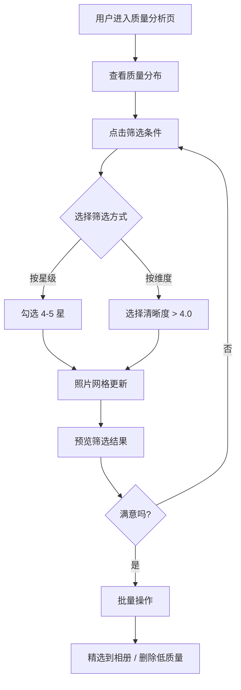
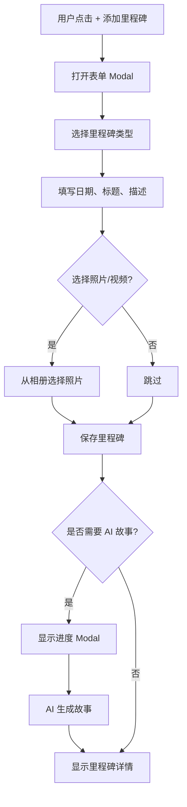

# Phase 3 UI/UX 设计方案

**设计时间**: 2026-02-14
**设计师**: UI/UX Designer
**目标平台**: Web (响应式) + Mobile (PWA)
**设计系统**: 基于 design-tokens.ts 和 design-tokens-enhanced.ts

---

## 目录

1. [设计目标](#设计目标)
2. [功能 1: AI 照片质量评分](#功能-1-ai-照片质量评分)
3. [功能 2: 场景分类](#功能-2-场景分类)
4. [功能 3: 智能去重](#功能-3-智能去重)
5. [功能 4: 增强时间线](#功能-4-增强时间线)
6. [功能 5: 社交功能](#功能-5-社交功能)
7. [设计系统扩展](#设计系统扩展)
8. [响应式设计](#响应式设计)
9. [无障碍访问](#无障碍访问)

---

## 设计目标

### 用户体验目标

1. **智能化操作**: AI 功能减少用户手动筛选工作
2. **信任感**: 去重、评分等功能透明可控
3. **情感连接**: 增强时间线让回忆更生动
4. **协作顺畅**: 家庭成员协作简单直观

### 业务目标

1. **提升留存**: 智能功能提升用户粘性
2. **降低流失**: 自动化减少重复劳动
3. **增加活跃**: 社交功能促进互动
4. **品质感知**: 精美设计提升产品价值

---

## 功能 1: AI 照片质量评分

### 1.1 用户目标

- 快速识别高质量照片
- 批量筛选低质量照片
- 了解照片质量分析维度

### 1.2 页面结构

#### 1.2.1 质量评分概览页

```
+---------------------------------------------------------------+
|  Header: 照片质量分析                            [筛选] [排序] |
+---------------------------------------------------------------+
|                                                               |
|  +---------------------------+  +---------------------------+  |
|  | 质量分布图               |  | 质量统计                 |  |
|  | [饼图/柱状图]            |  | 5星: 234 张 (12%)        |  |
|  | 5星: 12%                |  | 4星: 1,245 张 (64%)      |  |
|  | 4星: 64%                |  | 3星: 312 张 (16%)        |  |
|  | 3星: 16%                |  | 2星: 102 张 (5%)         |  |
|  | 2星: 5%                 |  | 1星: 56 张 (3%)          |  |
|  | 1星: 3%                 |  |                          |  |
|  +---------------------------+  +---------------------------+  |
|                                                               |
|  +---------------------------------------------------------+  |
|  | 照片网格 (带质量徽章)                                    |  |
|  |                                                         |  |
|  |  [⭐⭐⭐⭐⭐]  [⭐⭐⭐⭐]  [⭐⭐⭐]    |  |
|  |   [照片1]     [照片2]    [照片3]        |  |
|  |                                                         |  |
|  |  [⭐⭐]      [⭐]        [⭐⭐⭐⭐]    |  |
|  |   [照片4]     [照片5]    [照片6]        |  |
|  |                                                         |  |
|  +---------------------------------------------------------+  |
|                                                               |
+---------------------------------------------------------------+
```

#### 1.2.2 单张照片质量详情

```
+---------------------------------------------------------------+
|  ← 返回                  照片质量分析详情              [关闭]   |
+---------------------------------------------------------------+
|                                                               |
|  +-------------------------+  +------------------------------+  |
|  |                         |  | 质量评分: ⭐⭐⭐⭐ (4.2)    |  |
|  |    [照片预览]          |  |                              |  |
|  |                         |  | 综合评价: 优秀              |  |
|  |                         |  +------------------------------+  |
|  +-------------------------+                                 |
|                                                               |
|  详细分析:                                                     |
|  +--------------------------------------------------------+  |
|  | ✓ 清晰度: 4.5/5.0         [进度条: ████████░ 90%]    |  |
|  | ✓ 构图: 4.0/5.0            [进度条: ███████░░ 80%]    |  |
|  | ✓ 光线: 3.8/5.0            [进度条: ██████░░░ 76%]    |  |
|  | ✓ 色彩: 4.3/5.0            [进度条: ███████░░ 86%]    |  |
|  | ✓ 主体: 4.0/5.0            [进度条: ███████░░ 80%]    |  |
|  +--------------------------------------------------------+  |
|                                                               |
|  AI 建议:                                                     |
|  "这张照片光线充足,主体清晰,构图良好。建议保留。"              |
|                                                               |
|  [✓ 保留到精选相册]  [✗ 删除]  [→ 分享]                     |
|                                                               |
+---------------------------------------------------------------+
```

### 1.3 组件设计

#### 组件 A: `QualityBadge` (质量徽章)

**职责**: 显示照片质量评分的视觉徽章

**Props 接口**:

```typescript
interface QualityBadgeProps {
  score: number; // 0-5
  variant?: 'compact' | 'detailed';
  showStars?: boolean;
  position?: 'top-left' | 'top-right' | 'bottom-left' | 'bottom-right';
}
```

**样式设计**:

```tsx
// 质量等级颜色
const qualityColors = {
  5: { bg: 'from-emerald-400 to-green-500', text: 'text-white' },    // 优秀
  4: { bg: 'from-blue-400 to-cyan-500', text: 'text-white' },        // 良好
  3: { bg: 'from-yellow-400 to-amber-500', text: 'text-white' },     // 一般
  2: { bg: 'from-orange-400 to-red-400', text: 'text-white' },        // 较差
  1: { bg: 'from-red-500 to-pink-500', text: 'text-white' },         // 很差
};

// 示例渲染
<QualityBadge score={4.2} variant="detailed" showStars={true} />
// 输出: 渐变背景徽章,显示 "⭐⭐⭐⭐ 4.2"
```

**CSS 类名**:

```tsx
className={`
  absolute top-3 right-3
  bg-gradient-to-r ${qualityColors[score].bg}
  ${qualityColors[score].text}
  px-3 py-1.5 rounded-full
  text-sm font-bold
  shadow-lg backdrop-blur-sm
  flex items-center gap-1.5
  transition-all duration-300
  hover:scale-110 hover:shadow-xl
`}
```

#### 组件 B: `QualityFilterBar` (质量筛选栏)

**职责**: 提供质量筛选和排序功能

**Props 接口**:

```typescript
interface QualityFilterBarProps {
  onFilterChange: (filter: QualityFilter) => void;
  onSortChange: (sort: SortOption) => void;
  currentFilter?: QualityFilter;
  currentSort?: SortOption;
  stats?: QualityStats;
}

interface QualityFilter {
  minRating?: number; // 0-5
  maxRating?: number;
  categories?: ('blur' | 'lighting' | 'composition' | 'subject')[];
}

interface QualityStats {
  total: number;
  byRating: Record<number, number>; // {5: 234, 4: 1245, ...}
}
```

**布局设计**:

```tsx
<div className="flex flex-wrap gap-3 items-center justify-between bg-white rounded-2xl shadow-md p-4">
  {/* 左侧: 筛选器 */}
  <div className="flex gap-2">
    <QualityToggle value={5} count={stats.byRating[5]} />
    <QualityToggle value={4} count={stats.byRating[4]} />
    <QualityToggle value={3} count={stats.byRating[3]} />
    <QualityToggle value={2} count={stats.byRating[2]} />
    <QualityToggle value={1} count={stats.byRating[1]} />
  </div>

  {/* 右侧: 排序和批量操作 */}
  <div className="flex gap-2">
    <SortDropdown />
    <BatchActionButton label="批量精选" />
  </div>
</div>
```

#### 组件 C: `QualityProgressBar` (质量进度条)

**职责**: 显示单个维度的质量评分

**Props 接口**:

```typescript
interface QualityProgressBarProps {
  label: string;
  score: number; // 0-5
  maxScore?: number;
  color?: 'success' | 'info' | 'warning' | 'error';
  showValue?: boolean;
  animate?: boolean;
}
```

**样式设计**:

```tsx
<div className="flex items-center gap-3">
  {/* 标签 */}
  <span className="text-sm font-medium text-gray-700 w-20">{label}</span>

  {/* 进度条容器 */}
  <div className="flex-1 h-3 bg-gray-200 rounded-full overflow-hidden">
    {/* 进度条填充 */}
    <div
      className={`
        h-full rounded-full
        bg-gradient-to-r ${getGradientColor(color)}
        transition-all duration-1000 ease-out
        ${animate ? 'animate-progress' : ''}
      `}
      style={{ width: `${(score / maxScore) * 100}%` }}
    />
  </div>

  {/* 分数显示 */}
  {showValue && (
    <span className="text-sm font-bold text-gray-700 w-12 text-right">
      {score.toFixed(1)}/{maxScore}
    </span>
  )}
}
```

### 1.4 交互流程

#### 流程 1: 质量筛选



#### 流程 2: 批量操作

| 操作 | 触发方式 | UI 反馈 | 确认 |
|------|----------|---------|------|
| 批量精选 | 点击"批量精选"按钮 | 进入选择模式 | Modal 确认 |
| 批量删除 | 点击"批量删除"按钮 | 进入选择模式 + 红色警告 | 二次确认 |
| 批量下载 | 点击"批量下载"按钮 | Toast + 进度条 | 无 |

**选择模式 UI**:

```
+---------------------------------------------------------------+
|  [✓] 已选择 12 张照片  [取消选择]                               |
+---------------------------------------------------------------+
|  [✓ 精选到相册] [✗ 删除] [⬇ 下载] [→ 分享]                    |
+---------------------------------------------------------------+
|  照片网格 (全选框 + 单选框)                                    |
```

### 1.5 响应式设计

| 屏幕尺寸 | 布局调整 |
|----------|----------|
| Mobile (< 640px) | 单列网格,筛选器折叠为下拉菜单 |
| Tablet (640-1023px) | 双列网格,筛选器水平滚动 |
| Desktop (≥ 1024px) | 3-4 列网格,筛选器完整显示 |

---

## 功能 2: 场景分类

### 2.1 用户目标

- 快速找到特定场景的照片
- 自动归类减少手动整理
- 浏览不同场景的回忆

### 2.2 页面结构

#### 2.2.1 场景分类首页

```
+---------------------------------------------------------------+
|  Header: 场景分类                           [+ 新建场景标签]   |
+---------------------------------------------------------------+
|                                                               |
|  +---------------------------------------------------------+  |
|  | 搜索场景标签: [________________] [搜索]                   |  |
|  +---------------------------------------------------------+  |
|                                                               |
|  场景分类 (自动 + 手动):                                       |
|  +-------------------------------------------------------+   |
|  |                                                       |   |
|  |  +----------+  +----------+  +----------+  +----------+ |   |
|  |  | 🏖️ 海边  |  | 🎂 生日  |  | 🏠 在家  |  | 🌳 公园  | |   |
|  |  | 345 张   |  | 128 张   |  | 892 张   |  | 234 张   | |   |
|  |  +----------+  +----------+  +----------+  +----------+ |   |
|  |                                                       |   |
|  |  +----------+  +----------+  +----------+  +----------+ |   |
|  |  | 🍜 美食  |  | ✈️ 旅行  |  | 🎄 节日  |  | 🏫 学校  | |   |
|  |  | 56 张    |  | 478 张   |  | 23 张    |  | 12 张    | |   |
|  |  +----------+  +----------+  +----------+  +----------+ |   |
|  |                                                       |   |
|  +-------------------------------------------------------+   |
|                                                               |
|  未分类照片 (234 张):  [→ 开始自动分类]                         |
|                                                               |
+---------------------------------------------------------------+
```

#### 2.2.2 场景详情页

```
+---------------------------------------------------------------+
|  ← 返回        🏖️ 海边                            [筛选] [排序] |
+---------------------------------------------------------------+
|                                                               |
|  统计: 345 张照片 | 2023-01-15 至今 | 自动分类                 |
|                                                               |
|  +---------------------------------------------------------+  |
|  |                                                         |  |
|  |   [照片1]  [照片2]  [照片3]  [照片4]                    |  |
|  |                                                         |  |
|  |   [照片5]  [照片6]  [照片7]  [照片8]                    |  |
|  |                                                         |  |
|  +---------------------------------------------------------+  |
|                                                               |
|  [✓ 批量精选] [✗ 删除] [→ 合并到其他场景]                    |
|                                                               |
+---------------------------------------------------------------+
```

### 2.3 组件设计

#### 组件 A: `SceneCard` (场景卡片)

**职责**: 显示单个场景的分类卡片

**Props 接口**:

```typescript
interface SceneCardProps {
  scene: Scene;
  onClick: () => void;
  onEdit?: () => void;
  onDelete?: () => void;
  variant?: 'grid' | 'list' | 'compact';
}

interface Scene {
  id: string;
  name: string;
  icon: string; // Emoji 或图标 URL
  photoCount: number;
  coverPhoto?: string;
  isAutoGenerated: boolean;
  dateRange?: { start: Date; end: Date };
}
```

**样式设计**:

```tsx
// Grid 版本
<div className={`
  group relative overflow-hidden
  rounded-2xl shadow-md
  bg-white
  hover:shadow-xl hover:-translate-y-1
  transition-all duration-300
  cursor-pointer
`}>

  {/* 封面照片 (带渐变遮罩) */}
  <div className="aspect-[4/3] relative overflow-hidden">
    {coverPhoto ? (
      
    ) : (
      <div className={`w-full h-full bg-gradient-to-br ${randomGradient()}`} />
    )}

    {/* 图标和名称遮罩 */}
    <div className="absolute inset-0 bg-gradient-to-t from-black/70 via-black/20 to-transparent" />

    <div className="absolute bottom-0 left-0 right-0 p-4">
      <div className="flex items-center gap-2">
        <span className="text-3xl">{icon}</span>
        <div>
          <h3 className="text-white font-bold text-lg">{name}</h3>
          <p className="text-white/80 text-sm">{photoCount} 张照片</p>
        </div>
      </div>
    </div>

    {/* 自动分类标签 */}
    {isAutoGenerated && (
      <div className="absolute top-3 right-3">
        <span className="bg-blue-500 text-white text-xs px-2 py-1 rounded-full">
          AI 自动分类
        </span>
      </div>
    )}
  </div>
</div>
```

#### 组件 B: `SceneCategoryGrid` (场景分类网格)

**职责**: 场景分类的网格布局容器

**Props 接口**:

```typescript
interface SceneCategoryGridProps {
  scenes: Scene[];
  onSceneClick: (scene: Scene) => void;
  onSceneEdit?: (scene: Scene) => void;
  onSceneDelete?: (scene: Scene) => void;
  layout?: 'grid' | 'list';
  filter?: SceneFilter;
}

interface SceneFilter {
  search?: string;
  isAutoGenerated?: boolean;
  minPhotoCount?: number;
}
```

**响应式布局**:

```tsx
<div className={`
  grid gap-6
  grid-cols-1
  sm:grid-cols-2
  md:grid-cols-3
  lg:grid-cols-4
  xl:grid-cols-5
`}>
  {scenes.map(scene => (
    <SceneCard
      key={scene.id}
      scene={scene}
      onClick={() => onSceneClick(scene)}
      onEdit={onSceneEdit}
      onDelete={onSceneDelete}
      variant="grid"
    />
  ))}
</div>
```

#### 组件 C: `AutoClassifyButton` (自动分类按钮)

**职责**: 触发自动分类功能

**Props 接口**:

```typescript
interface AutoClassifyButtonProps {
  onClassify: () => Promise<ClassifyResult>;
  disabled?: boolean;
  isProcessing?: boolean;
  progress?: number; // 0-100
}

interface ClassifyResult {
  total: number;
  classified: number;
  scenes: { scene: Scene; count: number }[];
}
```

**样式设计**:

```tsx
<button
  disabled={disabled || isProcessing}
  className={`
    flex items-center gap-2 px-6 py-3
    rounded-xl font-medium
    transition-all duration-300
    ${isProcessing
      ? 'bg-gray-100 text-gray-400 cursor-not-allowed'
      : 'bg-gradient-to-r from-blue-500 to-cyan-400 text-white hover:from-blue-600 hover:to-cyan-500 shadow-lg hover:shadow-xl'
    }
  `}
>
  {isProcessing ? (
    <>
      <Spinner />
      <span>正在分类... {progress}%</span>
    </>
  ) : (
    <>
      <SparklesIcon />
      <span>AI 自动分类</span>
    </>
  )}
</button>
```

### 2.4 交互流程

#### 流程 1: 自动分类

```mermaid
graph TD
    A[用户点击"AI 自动分类"] --> B[显示确认 Modal]
    B --> C{用户确认?}
    C -->|否| A
    C -->|是| D[显示进度 Modal]
    D --> E[后端 AI 分析照片]
    E --> F[实时更新进度]
    F --> G{完成?}
    G -->|否| F
    G -->|是| H[显示分类结果]
    H --> I[新建了 X 个场景]
    I --> J[分类了 Y 张照片]
    J --> K[用户查看结果]
```

#### 流程 2: 手动创建场景

| 步骤 | 操作 | UI 元素 |
|------|------|----------|
| 1 | 点击"新建场景标签" | Floating Action Button |
| 2 | 填写场景信息 | Modal 表单 |
| 3 | 选择图标 | Emoji 选择器 |
| 4 | 选择照片 | 多选照片网格 |
| 5 | 保存 | 按钮 + Toast 成功提示 |

### 2.5 设计细节

#### 场景图标系统

使用 Emoji + 自定义图标组合:

| 场景类型 | 推荐图标 | 备用图标 |
|----------|----------|----------|
| 海边 | 🏖️ | 🌊 |
| 生日 | 🎂 | 🎉 |
| 在家 | 🏠 | 🛋️ |
| 公园 | 🌳 | 🏞️ |
| 美食 | 🍜 | 🍕 |
| 旅行 | ✈️ | 🗺️ |
| 节日 | 🎄 | 🎆 |
| 学校 | 🏫 | 📚 |

---

## 功能 3: 智能去重

### 3.1 用户目标

- 快速识别重复/相似照片
- 批量删除重复照片
- 保留质量最好的版本

### 3.2 页面结构

#### 3.2.1 去重概览页

```
+---------------------------------------------------------------+
|  Header: 智能去重                              [开始扫描]       |
+---------------------------------------------------------------+
|                                                               |
|  +---------------------------------------------------------+  |
|  | 扫描结果: 发现 23 组重复照片 (共 56 张)                   |  |
|  |                                                         |  |
|  | [统计图表]                                               |  |
|  | 完全重复: 12 组 (24 张)                                  |  |
|  | 相似照片: 11 组 (32 张)                                  |  |
|  +---------------------------------------------------------+  |
|                                                               |
|  +---------------------------------------------------------+  |
|  | 第 1 组 (3 张) - 相似度 95%                               |  |
|  |                                                         |  |
|  |   +----------+  +----------+  +----------+               |  |
|  |   | [照片1]  |  | [照片2]  |  | [照片3]  |               |  |
|  |   | ✓ 推荐   |  |          |  |          |               |  |
|  |   | ⭐4.5   |  | ⭐3.8    |  | ⭐4.0    |               |  |
|  |   +----------+  +----------+  +----------+               |  |
|  |                                                         |  |
|  |   [✓ 保留推荐] [→ 手动选择] [→ 全部删除]                 |  |
|  +---------------------------------------------------------+  |
|                                                               |
|  +---------------------------------------------------------+  |
|  | 第 2 组 (2 张) - 相似度 98%                               |  |
|  |   [照片1]  [照片2]                                      |  |
|  |   ✓ 推荐  ⭐4.2  ⭐3.5                                  |  |
|  |   [✓ 保留推荐] [→ 手动选择]                              |  |
|  +---------------------------------------------------------+  |
|                                                               |
+---------------------------------------------------------------+
```

#### 3.2.2 照片对比视图

```
+---------------------------------------------------------------+
|  ← 返回                   对比查看                     [关闭]    |
+---------------------------------------------------------------+
|                                                               |
|  第 1 组 (3 张) - 相似度 95%                                   |
|                                                               |
|  +---------------------------+  +---------------------------+    |
|  |                           |  |                           |    |
|  |     [照片1 - 推荐]       |  |       [照片2]            |    |
|  |                           |  |                           |    |
|  |     ⭐⭐⭐⭐⭐ (4.5)     |  |     ⭐⭐⭐⭐ (3.8)        |    |
|  |     清晰度: 4.8          |  |     清晰度: 3.5          |    |
|  |     构图: 4.3            |  |     构图: 4.0            |    |
|  |     光线: 4.5            |  |     光线: 4.2            |    |
|  |                           |  |                           |    |
|  |     [✓ 保留这张]        |  |     [✓ 保留这张]         |    |
|  |                           |  |                           |    |
|  +---------------------------+  +---------------------------+    |
|                                                               |
|  +---------------------------+                                    |
|  |                           |                                    |
|  |       [照片3]             |                                    |
|  |                           |                                    |
|  |     ⭐⭐⭐⭐ (4.0)        |                                    |
|  |     清晰度: 4.2           |                                    |
|  |     构图: 3.8             |                                    |
|  |     光线: 4.0             |                                    |
|  |                           |                                    |
|  |     [✓ 保留这张]         |                                    |
|  |                           |                                    |
|  +---------------------------+                                    |
|                                                               |
|  [← 上一组]          [✓ 确认选择]          [→ 下一组]         |
|                                                               |
+---------------------------------------------------------------+
```

### 3.3 组件设计

#### 组件 A: `DuplicateGroupCard` (重复组卡片)

**职责**: 显示一组重复/相似照片

**Props 接口**:

```typescript
interface DuplicateGroupCardProps {
  group: DuplicateGroup;
  onKeepPhoto: (photoId: string) => void;
  onManualSelect: () => void;
  onDeleteAll: () => void;
  isExpanded?: boolean;
}

interface DuplicateGroup {
  id: string;
  photos: DuplicatePhoto[];
  similarity: number; // 0-100
  type: 'exact' | 'similar';
  recommendedPhotoId: string;
}

interface DuplicatePhoto {
  id: string;
  url: string;
  qualityScore: number;
  metrics: QualityMetrics;
}
```

**样式设计**:

```tsx
<div className="bg-white rounded-2xl shadow-md hover:shadow-lg transition-all duration-300 overflow-hidden">

  {/* 组头部 */}
  <div className="bg-gradient-to-r from-orange-50 to-red-50 px-6 py-4 border-b border-orange-200">
    <div className="flex items-center justify-between">
      <div>
        <h3 className="font-bold text-gray-800">
          第 {groupIndex} 组 ({group.photos.length} 张)
          <span className="ml-2 text-sm font-normal text-gray-600">
            - 相似度 {group.similarity}%
          </span>
        </h3>
      </div>

      <div className="flex gap-2">
        {group.type === 'exact' && (
          <span className="bg-red-100 text-red-700 text-xs px-3 py-1 rounded-full font-medium">
            完全重复
          </span>
        )}
        {group.type === 'similar' && (
          <span className="bg-orange-100 text-orange-700 text-xs px-3 py-1 rounded-full font-medium">
            高度相似
          </span>
        )}
      </div>
    </div>
  </div>

  {/* 照片网格 */}
  <div className="p-6">
    <div className="grid grid-cols-2 md:grid-cols-3 lg:grid-cols-4 gap-4">
      {group.photos.map(photo => (
        <div key={photo.id} className="relative group">
          {/* 照片预览 */}
          

          {/* 推荐标签 */}
          {photo.id === group.recommendedPhotoId && (
            <div className="absolute top-2 left-2 bg-green-500 text-white text-xs px-2 py-1 rounded-full font-bold flex items-center gap-1">
              <CheckIcon />
              推荐
            </div>
          )}

          {/* 质量分数 */}
          <div className="absolute bottom-2 right-2 bg-black/60 text-white text-xs px-2 py-1 rounded-full">
            ⭐ {photo.qualityScore.toFixed(1)}
          </div>
        </div>
      ))}
    </div>
  </div>

  {/* 操作按钮 */}
  <div className="px-6 py-4 bg-gray-50 border-t flex gap-3">
    <button
      onClick={() => onKeepPhoto(group.recommendedPhotoId)}
      className="flex-1 bg-green-500 hover:bg-green-600 text-white px-4 py-2 rounded-xl font-medium transition-colors flex items-center justify-center gap-2"
    >
      <CheckIcon />
      保留推荐 ({group.photos.filter(p => p.id === group.recommendedPhotoId)[0].qualityScore.toFixed(1)})
    </button>

    <button
      onClick={onManualSelect}
      className="flex-1 bg-blue-500 hover:bg-blue-600 text-white px-4 py-2 rounded-xl font-medium transition-colors flex items-center justify-center gap-2"
    >
      <EyeIcon />
      手动选择
    </button>

    <button
      onClick={onDeleteAll}
      className="bg-red-500 hover:bg-red-600 text-white px-4 py-2 rounded-xl font-medium transition-colors flex items-center justify-center gap-2"
    >
      <TrashIcon />
      全部删除
    </button>
  </div>
</div>
```

#### 组件 B: `PhotoComparisonView` (照片对比视图)

**职责**: 并排对比多张照片,方便用户选择

**Props 接口**:

```typescript
interface PhotoComparisonViewProps {
  group: DuplicateGroup;
  selectedPhotoId: string | null;
  onPhotoSelect: (photoId: string) => void;
  onConfirm: () => void;
  onNextGroup?: () => void;
  onPrevGroup?: () => void;
}
```

**样式设计**:

```tsx
<div className="flex flex-col h-full">

  {/* 照片对比区域 */}
  <div className="flex-1 grid grid-cols-2 lg:grid-cols-3 gap-6 p-6">

    {group.photos.map(photo => (
      <div
        key={photo.id}
        onClick={() => onPhotoSelect(photo.id)}
        className={`
          relative group cursor-pointer
          rounded-2xl overflow-hidden shadow-lg
          transition-all duration-300
          ${selectedPhotoId === photo.id
            ? 'ring-4 ring-green-500 scale-105'
            : 'hover:scale-102'
          }
        `}
      >

        {/* 照片 */}
        

        {/* 选中标记 */}
        {selectedPhotoId === photo.id && (
          <div className="absolute top-4 left-4 bg-green-500 text-white px-3 py-1.5 rounded-full font-bold flex items-center gap-1 shadow-lg">
            <CheckIcon />
            已选择
          </div>
        )}

        {/* 推荐标记 */}
        {photo.id === group.recommendedPhotoId && (
          <div className="absolute top-4 right-4 bg-blue-500 text-white px-3 py-1.5 rounded-full font-bold shadow-lg">
            AI 推荐
          </div>
        )}

        {/* 质量指标遮罩 */}
        <div className="absolute bottom-0 left-0 right-0 p-4 bg-gradient-to-t from-black/80 to-transparent">
          <div className="text-white space-y-1">
            <div className="flex items-center gap-2">
              <StarIcon className="text-yellow-400" />
              <span className="font-bold">{photo.qualityScore.toFixed(1)} / 5.0</span>
            </div>

            <div className="text-sm space-y-0.5">
              <div className="flex justify-between">
                <span>清晰度:</span>
                <span>{photo.metrics.clarity.toFixed(1)}</span>
              </div>
              <div className="flex justify-between">
                <span>构图:</span>
                <span>{photo.metrics.composition.toFixed(1)}</span>
              </div>
              <div className="flex justify-between">
                <span>光线:</span>
                <span>{photo.metrics.lighting.toFixed(1)}</span>
              </div>
            </div>
          </div>
        </div>

      </div>
    ))}

  </div>

  {/* 底部操作栏 */}
  <div className="border-t bg-white p-4 flex items-center justify-between">
    <button
      onClick={onPrevGroup}
      className="px-6 py-3 rounded-xl font-medium text-gray-600 hover:bg-gray-100 transition-colors"
    >
      ← 上一组
    </button>

    <button
      onClick={onConfirm}
      disabled={!selectedPhotoId}
      className="px-8 py-3 rounded-xl font-medium bg-green-500 hover:bg-green-600 text-white shadow-lg disabled:opacity-50 disabled:cursor-not-allowed transition-all flex items-center gap-2"
    >
      <CheckIcon />
      确认保留此张
    </button>

    <button
      onClick={onNextGroup}
      className="px-6 py-3 rounded-xl font-medium text-gray-600 hover:bg-gray-100 transition-colors"
    >
      下一组 →
    </button>
  </div>

</div>
```

### 3.4 交互流程

#### 流程 1: 批量去重

```mermaid
graph TD
    A[用户点击"开始扫描"] --> B[显示进度 Modal]
    B --> C[后端分析照片相似度]
    C --> D[实时更新扫描进度]
    D --> E{扫描完成}
    E --> F[显示去重概览页]
    F --> G[查看重复组]
    G --> H{选择处理方式}
    H -->|保留推荐| I[点击"保留推荐"]
    H -->|手动选择| J[进入对比视图]
    H -->|全部删除| K[二次确认后删除]
    I --> L[批量删除非推荐照片]
    J --> M[用户选择照片]
    M --> L
    K --> L
    L --> N[显示完成报告]
    N --> O[释放了 X MB 存储空间]
```

#### 流程 2: 手动对比选择

| 步骤 | 用户操作 | UI 变化 |
|------|----------|----------|
| 1 | 点击"手动选择" | 进入对比视图 Modal |
| 2 | 查看照片质量指标 | 照片下方显示详细指标 |
| 3 | 点击选择照片 | 选中照片获得绿色边框 |
| 4 | 点击"确认保留" | 其他照片标记为待删除 |
| 5 | 返回概览页 | 该组显示"已处理"状态 |

### 3.5 设计细节

#### 相似度可视化

使用颜色和标签区分相似度等级:

| 相似度 | 颜色 | 标签 | 处理建议 |
|--------|------|------|----------|
| 95-100% | 红色 | 完全重复 | 建议删除重复 |
| 85-94% | 橙色 | 高度相似 | 手动选择 |
| 75-84% | 黄色 | 中度相似 | 可选处理 |
| < 75% | 绿色 | 轻微相似 | 一般不处理 |

#### 批处理进度

```
+---------------------------------------------------------------+
|  正在扫描照片...                                             |
|  +---------------------------------------------------------+  |
|  | 进度: ████████████████████░░░░░░░░░░░░  67% (1234/1890)|  |
|  +---------------------------------------------------------+  |
|  已发现 23 组重复照片                                        |
|  预计剩余时间: 30 秒                                         |
|                                                               |
|  [取消扫描]                                                   |
+---------------------------------------------------------------+
```

---

## 功能 4: 增强时间线

### 4.1 用户目标

- 可视化宝宝成长历程
- 标记重要里程碑事件
- 自动生成成长故事
- 分享成长回忆

### 4.2 页面结构

#### 4.2.1 增强时间线首页

```
+---------------------------------------------------------------+
|  Header: 成长时间线                    [+ 添加里程碑] [筛选]  |
+---------------------------------------------------------------+
|                                                               |
|  +---------------------------------------------------------+  |
|  | 时间轴导航器                                             |  |
|  |  ◀─────●─────●─────●─────●─────●─────▶               |  |
|  |  2023    2024    2025    2026                           |  |
|  +---------------------------------------------------------+  |
|                                                               |
|  +---------------------------------------------------------+  |
|  |                                                         |  |
|  |  [里程碑图标]                                            |  |
|  |      🎂                                                |  |
|  |      |                                                  |  |
|  |      | 2024-01-15                                       |  |
|  |      |                                                  |  |
|  |      | ────────► 1 岁生日                             |  |
|  |      |          [照片网格: 45 张]                        |  |
|  |      |                                                  |  |
|  |      | ────────► [生成故事]                            |  |
|  |      |          "宝宝的第一个生日派对,邀请了..."           |  |
|  |      |          [展开全文]                               |  |
|  |      |                                                  |  |
|  |      |                                                  |  |
|  |  [里程碑图标]                                            |  |
|  |      👶                                                |  |
|  |      |                                                  |  |
|  |      | 2023-07-20                                       |  |
|  |      |                                                  |  |
|  |      | ────────► 第一步                                 |  |
|  |      |          [照片网格: 23 张]                        |  |
|  |      |          [视频: 3 个]                            |  |
|  |      |                                                  |  |
|  |      |                                                  |  |
|  |  [里程碑图标]                                            |  |
|  |      💬                                                |  |
|  |      |                                                  |  |
|  |      | 2023-06-15                                       |  |
|  |      |                                                  |  |
|  |      | ────────► 第一句话                               |  |
|  |      |          "妈妈!"                                  |  |
|  |      |          [音频: ▶]                               |  |
|  |      |          [视频: 1 个]                            |  |
|  |      |                                                  |  |
|  +---------------------------------------------------------+  |
|                                                               |
+---------------------------------------------------------------+
```

#### 4.2.2 里程碑详情页

```
+---------------------------------------------------------------+
|  ← 返回                  🎂 1 岁生日                       [编辑] |
+---------------------------------------------------------------|
|                                                               |
|  2024-01-15 (星期一)                                          |
|                                                               |
|  +---------------------------------------------------------+  |
|  | 照片/视频 (45 张照片, 3 个视频)                          |  |
|  |                                                         |  |
|  |   [照片1] [照片2] [照片3] [照片4]                      |  |
|  |   [照片5] [照片6] [照片7] [照片8]                      |  |
|  |                                                         |  |
|  |   [查看全部 45 张 →]                                    |  |
|  +---------------------------------------------------------+  |
|                                                               |
|  +---------------------------------------------------------+  |
|  | 里程碑故事                                               |  |
|  |                                                         |  |
|  | 今天是小宝贝的 1 岁生日!我们在家里举办了一个温馨的生日派  |  |
|  | 对,邀请了爷爷奶奶和几个好朋友一起庆祝。宝宝穿上了新衣服,   |  |
|  | 看到生日蜡烛时眼睛亮晶晶的,还尝试着吹灭了蜡烛...         |  |
|  |                                                         |  |
|  | [展开全文]                                               |  |
|  +---------------------------------------------------------+  |
|                                                               |
|  +---------------------------------------------------------+  |
|  | AI 生长的故事                                            |  |
|  |                                                         |  |
|  | "这是宝宝人生中的第一个生日,标志着他已经迈入了幼儿阶段。   |  |
|  | 在过去的一年里,宝宝学会了翻身、爬行、走路,每一天都在快乐   |  |
|  | 地成长着..."                                            |  |
|  |                                                         |  |
|  | [🔄 重新生成] [✓ 保存到相册]                           |  |
|  +---------------------------------------------------------+  |
|                                                               |
|  [← 上一里程碑]          [→ 下一里程碑]                     |
|                                                               |
+---------------------------------------------------------------+
```

### 4.3 组件设计

#### 组件 A: `MilestoneTimeline` (里程碑时间轴)

**职责**: 垂直时间轴,展示里程碑事件

**Props 接口**:

```typescript
interface MilestoneTimelineProps {
  milestones: Milestone[];
  onMilestoneClick: (milestone: Milestone) => void;
  onMilestoneAdd?: () => void;
  onMilestoneEdit?: (milestone: Milestone) => void;
  onMilestoneDelete?: (milestoneId: string) => void;
  filter?: MilestoneFilter;
}

interface Milestone {
  id: string;
  type: 'birthday' | 'first_step' | 'first_word' | 'custom' | 'holiday';
  date: Date;
  title: string;
  description?: string;
  photos: Photo[];
  videos: Video[];
  audio?: string; // Base64 or URL
  aiStory?: string;
}

interface MilestoneFilter {
  type?: Milestone['type'][];
  dateRange?: { start: Date; end: Date };
  hasPhotos?: boolean;
  hasStory?: boolean;
}
```

**样式设计**:

```tsx
<div className="relative">

  {/* 垂直连接线 */}
  <div className="absolute left-8 top-0 bottom-0 w-0.5 bg-gradient-to-b from-blue-400 via-purple-400 to-pink-400" />

  {/* 里程碑列表 */}
  <div className="space-y-8">

    {milestones.map((milestone, index) => (
      <div key={milestone.id} className="relative flex gap-6">

        {/* 里程碑图标 */}
        <div className={`
          relative z-10 w-16 h-16 rounded-full
          flex items-center justify-center text-3xl
          shadow-lg border-4 border-white
          ${getMilestoneColor(milestone.type)}
        `}>
          {getMilestoneIcon(milestone.type)}
        </div>

        {/* 内容卡片 */}
        <div
          onClick={() => onMilestoneClick(milestone)}
          className="flex-1 bg-white rounded-2xl shadow-md hover:shadow-lg transition-all duration-300 cursor-pointer overflow-hidden"
        >

          {/* 卡片头部 */}
          <div className={`
            px-6 py-4 border-l-4
            ${getMilestoneAccentColor(milestone.type)}
          `}>
            <div className="flex items-center justify-between">
              <div>
                <h3 className="font-bold text-gray-800 text-lg">{milestone.title}</h3>
                <p className="text-sm text-gray-500">
                  {formatDate(milestone.date)}
                </p>
              </div>

              <div className="flex items-center gap-2">
                {milestone.photos.length > 0 && (
                  <span className="bg-blue-100 text-blue-700 text-xs px-2 py-1 rounded-full">
                    {milestone.photos.length} 张照片
                  </span>
                )}
                {milestone.videos.length > 0 && (
                  <span className="bg-purple-100 text-purple-700 text-xs px-2 py-1 rounded-full">
                    {milestone.videos.length} 个视频
                  </span>
                )}
              </div>
            </div>
          </div>

          {/* 照片预览网格 */}
          {milestone.photos.length > 0 && (
            <div className="px-6 py-4 border-t">
              <div className="grid grid-cols-4 gap-2">
                {milestone.photos.slice(0, 8).map(photo => (
                  
                ))}
              </div>

              {milestone.photos.length > 8 && (
                <div className="mt-2 text-center text-sm text-blue-600 font-medium cursor-pointer hover:text-blue-700">
                  查看全部 {milestone.photos.length} 张 →
                </div>
              )}
            </div>
          )}

          {/* AI 故事预览 */}
          {milestone.aiStory && (
            <div className="px-6 py-4 border-t bg-gradient-to-r from-purple-50 to-pink-50">
              <div className="flex items-start gap-2">
                <SparklesIcon className="text-purple-500 mt-0.5" />
                <div className="flex-1">
                  <p className="text-sm text-gray-700 line-clamp-2">
                    {milestone.aiStory}
                  </p>
                  <button className="mt-2 text-sm text-purple-600 font-medium hover:text-purple-700 flex items-center gap-1">
                    查看完整故事 →
                  </button>
                </div>
              </div>
            </div>
          )}

        </div>

      </div>
    ))}

  </div>
</div>
```

#### 组件 B: `TimelineNavigator` (时间轴导航器)

**职责**: 水平时间轴,快速导航到不同年份/月份

**Props 接口**:

```typescript
interface TimelineNavigatorProps {
  milestones: Milestone[];
  currentDate: Date;
  onDateChange: (date: Date) => void;
  view?: 'year' | 'month' | 'week';
}
```

**样式设计**:

```tsx
<div className="bg-white rounded-2xl shadow-md p-4 overflow-x-auto">

  {/* 时间轴线 */}
  <div className="relative h-16 flex items-center justify-center">

    {/* 水平线 */}
    <div className="absolute left-0 right-0 h-0.5 bg-gradient-to-r from-blue-400 via-purple-400 to-pink-400" />

    {/* 年份/月份节点 */}
    <div className="flex gap-12 relative">

      {generateYearRange(2023, 2026).map((year, index) => {
        const hasMilestones = milestones.some(m => m.date.getFullYear() === year);

        return (
          <div
            key={year}
            onClick={() => onDateChange(new Date(year, 0, 1))}
            className={`
              relative cursor-pointer
              transition-all duration-300
              ${currentDate.getFullYear() === year
                ? 'scale-125'
                : 'hover:scale-110'
              }
            `}
          >
            {/* 节点圆点 */}
            <div className={`
              w-6 h-6 rounded-full border-4 border-white shadow-lg
              ${hasMilestones
                ? 'bg-gradient-to-r from-purple-400 to-pink-400'
                : 'bg-gray-300'
              }
              ${currentDate.getFullYear() === year
                ? 'ring-4 ring-purple-300'
                : ''
              }
            `} />

            {/* 年份标签 */}
            <div className="absolute top-8 left-1/2 -translate-x-1/2 whitespace-nowrap">
              <span className={`
                font-bold text-sm
                ${currentDate.getFullYear() === year
                  ? 'text-purple-600'
                  : 'text-gray-600'
                }
              `}>
                {year}
              </span>
            </div>
          </div>
        );
      })}

    </div>

  </div>

</div>
```

#### 组件 C: `MilestoneForm` (里程碑表单)

**职责**: 添加/编辑里程碑的表单

**Props 接口**:

```typescript
interface MilestoneFormProps {
  milestone?: Milestone;
  onSubmit: (data: MilestoneFormData) => Promise<void>;
  onCancel: () => void;
}

interface MilestoneFormData {
  type: Milestone['type'];
  date: Date;
  title: string;
  description?: string;
  photoIds: string[];
  videoIds?: string[];
  audio?: string;
}
```

**样式设计**:

```tsx
<form onSubmit={handleSubmit} className="space-y-6">

  {/* 里程碑类型选择 */}
  <div>
    <label className="block text-sm font-medium text-gray-700 mb-3">
      选择里程碑类型
    </label>
    <div className="grid grid-cols-2 sm:grid-cols-4 gap-3">
      {milestoneTypes.map(type => (
        <button
          key={type.value}
          type="button"
          onClick={() => setFieldValue('type', type.value)}
          className={`
            p-4 rounded-xl border-2 transition-all duration-300
            flex flex-col items-center gap-2
            ${formData.type === type.value
              ? 'border-purple-500 bg-purple-50'
              : 'border-gray-200 hover:border-purple-300'
            }
          `}
        >
          <span className="text-3xl">{type.icon}</span>
          <span className="text-sm font-medium text-gray-700">{type.label}</span>
        </button>
      ))}
    </div>
  </div>

  {/* 日期选择 */}
  <div>
    <label className="block text-sm font-medium text-gray-700 mb-2">
      日期
    </label>
    <input
      type="date"
      value={formData.date.toISOString().split('T')[0]}
      onChange={(e) => setFieldValue('date', new Date(e.target.value))}
      className="w-full px-4 py-3 border-2 border-gray-200 rounded-xl focus:border-purple-500 focus:ring-2 focus:ring-purple-500/20 outline-none transition-all"
    />
  </div>

  {/* 标题 */}
  <div>
    <label className="block text-sm font-medium text-gray-700 mb-2">
      标题
    </label>
    <input
      type="text"
      value={formData.title}
      onChange={(e) => setFieldValue('title', e.target.value)}
      placeholder="例如: 1 岁生日、第一次走路..."
      className="w-full px-4 py-3 border-2 border-gray-200 rounded-xl focus:border-purple-500 focus:ring-2 focus:ring-purple-500/20 outline-none transition-all"
    />
  </div>

  {/* 描述 */}
  <div>
    <label className="block text-sm font-medium text-gray-700 mb-2">
      描述 (可选)
    </label>
    <textarea
      value={formData.description}
      onChange={(e) => setFieldValue('description', e.target.value)}
      placeholder="记录这一刻的回忆..."
      rows={4}
      className="w-full px-4 py-3 border-2 border-gray-200 rounded-xl focus:border-purple-500 focus:ring-2 focus:ring-purple-500/20 outline-none transition-all resize-none"
    />
  </div>

  {/* 选择照片 */}
  <div>
    <label className="block text-sm font-medium text-gray-700 mb-3">
      选择照片 (可选)
    </label>
    <PhotoSelector
      selectedPhotos={selectedPhotos}
      onSelectionChange={setSelectedPhotos}
      maxPhotos={20}
    />
  </div>

  {/* 操作按钮 */}
  <div className="flex gap-3 pt-4 border-t">
    <button
      type="button"
      onClick={onCancel}
      className="flex-1 px-6 py-3 rounded-xl font-medium text-gray-600 hover:bg-gray-100 transition-colors"
    >
      取消
    </button>
    <button
      type="submit"
      disabled={isSubmitting}
      className="flex-1 px-6 py-3 rounded-xl font-medium bg-gradient-to-r from-purple-500 to-pink-500 text-white hover:from-purple-600 hover:to-pink-600 shadow-lg disabled:opacity-50 disabled:cursor-not-allowed transition-all"
    >
      {isSubmitting ? '保存中...' : '保存里程碑'}
    </button>
  </div>

</form>
```

### 4.4 交互流程

#### 流程 1: 添加里程碑



#### 流程 2: 生成 AI 故事

| 步骤 | UI 状态 | 交互 |
|------|---------|------|
| 1 | 点击"生成故事"按钮 | 显示"正在生成..." |
| 2 | AI 分析照片和描述 | 进度条 + 动画 |
| 3 | 生成完成 | 显示故事文本 |
| 4 | 用户可编辑故事 | 文本框可编辑 |
| 5 | 点击保存 | 存储到数据库 |

**AI 生成进度 UI**:

```
+---------------------------------------------------------------+
|  AI 正在生成成长故事...                                       |
|                                                               |
|  +---------------------------------------------------------+  |
|  | ██████████████████░░░░░░░░  60%                         |  |
|  +---------------------------------------------------------+  |
|                                                               |
|  正在分析照片...                                              |
|  正在回忆这个时刻...                                          |
|  正在撰写故事...                                              |
|                                                               |
|  [取消]                                                       |
+---------------------------------------------------------------+
```

### 4.5 设计细节

#### 里程碑图标系统

| 类型 | 图标 | 颜色 | 使用场景 |
|------|------|------|----------|
| 生日 | 🎂 | 琥珀色 | 宝宝生日 |
| 第一步 | 👶 | 绿色 | 第一次走路 |
| 第一句话 | 💬 | 蓝色 | 第一次说话 |
| 节日 | 🎄 | 红色 | 节日庆祝 |
| 自定义 | ⭐ | 紫色 | 用户自定义 |

#### 故事生成提示

为 AI 提供生成建议:

- "描述这个重要时刻"
- "记录宝宝的成长变化"
- "回顾这个美好的回忆"

---

## 功能 5: 社交功能

### 5.1 用户目标

- 邀请家庭成员加入
- 分享照片给特定成员
- 协作管理相册
- 控制隐私和权限

### 5.2 页面结构

#### 5.2.1 家庭成员管理页

```
+---------------------------------------------------------------+
|  Header: 家庭成员管理                    [+ 邀请成员]           |
+---------------------------------------------------------------|
|                                                               |
|  家庭统计:                                                     |
|  +---------------------------------------------------------+  |
|  | 5 位成员 | 12 个共享相册 | 1,234 张共享照片           |  |
|  +---------------------------------------------------------+  |
|                                                               |
|  家庭成员列表:                                                 |
|  +---------------------------------------------------------+  |
|  |                                                         |  |
|  |  +----------------+  +----------------+  +----------------+ |  |
|  |  | [头像]         |  | [头像]         |  | [头像]         | |  |
|  |  | 👶 宝宝        |  | 👨 爸爸 (我)   |  | 👩 妈妈        | |  |
|  |  |               |  | 👑 管理员     |  |               | |  |
|  |  +----------------+  +----------------+  +----------------+ |  |
|  |                                                         |  |
|  |  +----------------+  +----------------+  +----------------+ |  |
|  |  | [头像]         |  | [头像]         |  | [头像]         | |  |
|  |  | 👵 奶奶        |  | 👷 爷爷       |  | ➕ 邀请成员    | |  |
|  |  |               |  | 成员          |  |               | |  |
|  |  +----------------+  +----------------+  +----------------+ |  |
|  |                                                         |  |
|  +---------------------------------------------------------+  |
|                                                               |
+---------------------------------------------------------------+
```

#### 5.2.2 邀请成员流程

```
+---------------------------------------------------------------+
|  邀请家庭成员                           [X]                    |
+---------------------------------------------------------------|
|                                                               |
|  分享邀请链接:                                                 |
|  +---------------------------------------------------------+  |
|  | https://family-album.app/invite/abc123def456            |  |
|  |                                              [📋 复制链接] |  |
|  +---------------------------------------------------------+  |
|                                                               |
|  或通过以下方式邀请:                                           |
|  +---------------------------------------------------------+  |
|  |                                                         |  |
|  |  +----------------+  +----------------+  +----------------+ |  |
|  |  | 📧 邮件       |  | 💬 微信      |  | 📱 短信      | |  |
|  |  +----------------+  +----------------+  +----------------+ |  |
|  |                                                         |  |
|  +---------------------------------------------------------+  |
|                                                               |
|  邀请链接设置:                                                 |
|  [ ] 链接 7 天后失效                                          |
|  [ ] 仅可使用一次                                              |
|  [ ] 需要我审批加入请求                                         |
|                                                               |
|  已发送的邀请:                                                 |
|  +---------------------------------------------------------+  |
|  | 👵 奶奶 | 已接受 | 2024-01-10                           |  |
|  | 👂 舅舅 | 待接受 | 2024-01-12 | 链接 3 天后失效       |  |
|  +---------------------------------------------------------+  |
|                                                               |
|  [取消] [发送邀请]                                            |
+---------------------------------------------------------------|
```

#### 5.2.3 权限管理

```
+---------------------------------------------------------------|
|  成员权限: 👵 奶奶                                             |
+---------------------------------------------------------------|
|                                                               |
|  角色选择:                                                     |
|  +---------------------------------------------------------+  |
|  | ● 成员 (默认)                                              |  |
|  |   可以查看和上传照片                                        |  |
|  |                                                         |  |
|  | ○ 管理员                                                  |  |
|  |   可以管理成员、相册、删除照片                              |  |
|  +---------------------------------------------------------+  |
|                                                               |
|  详细权限:                                                     |
|  +---------------------------------------------------------+  |
|  | [✓] 查看照片               [✓] 上传照片                 |  |
|  | [✓] 下载照片               [✓] 评论照片                 |  |
|  | [ ] 删除照片               [ ] 编辑里程碑               |  |
|  | [ ] 管理成员               [ ] 删除相册                 |  |
|  +---------------------------------------------------------+  |
|                                                               |
|  [取消] [保存更改]                                              |
+---------------------------------------------------------------|
```

### 5.3 组件设计

#### 组件 A: `MemberCard` (成员卡片)

**职责**: 显示家庭成员信息

**Props 接口**:

```typescript
interface MemberCardProps {
  member: FamilyMember;
  isCurrentUser?: boolean;
  onEditPermission?: (member: FamilyMember) => void;
  onRemove?: (memberId: string) => void;
}

interface FamilyMember {
  id: string;
  userId: string;
  role: 'admin' | 'member';
  avatar?: string;
  name: string;
  email?: string;
  joinedAt: Date;
  permissions: Permission[];
}

interface Permission {
  viewPhotos: boolean;
  uploadPhotos: boolean;
  downloadPhotos: boolean;
  deletePhotos: boolean;
  editMilestones: boolean;
  manageMembers: boolean;
  deleteAlbums: boolean;
}
```

**样式设计**:

```tsx
<div className="bg-white rounded-2xl shadow-md hover:shadow-lg transition-all duration-300 overflow-hidden">

  {/* 成员信息 */}
  <div className="p-6">
    <div className="flex items-center gap-4">

      {/* 头像 */}
      <div className="relative">
        {member.avatar ? (
          
        ) : (
          <div className="w-16 h-16 rounded-full bg-gradient-to-br from-blue-400 to-purple-400 flex items-center justify-center text-white text-2xl font-bold">
            {member.name.charAt(0)}
          </div>
        )}

        {/* 在线状态 */}
        <div className="absolute bottom-0 right-0 w-4 h-4 bg-green-500 border-2 border-white rounded-full" />
      </div>

      {/* 名字和角色 */}
      <div className="flex-1">
        <div className="flex items-center gap-2">
          <h3 className="font-bold text-gray-800 text-lg">{member.name}</h3>

          {/* 角色标签 */}
          {member.role === 'admin' && (
            <span className="bg-purple-100 text-purple-700 text-xs px-2 py-1 rounded-full font-medium flex items-center gap-1">
              <CrownIcon />
              管理员
            </span>
          )}

          {isCurrentUser && (
            <span className="bg-blue-100 text-blue-700 text-xs px-2 py-1 rounded-full font-medium">
              我
            </span>
          )}
        </div>

        <p className="text-sm text-gray-500 mt-1">
          加入于 {formatDate(member.joinedAt)}
        </p>
      </div>

      {/* 操作按钮 */}
      {!isCurrentUser && (
        <div className="flex gap-2">
          <button
            onClick={() => onEditPermission?.(member)}
            className="p-2 hover:bg-gray-100 rounded-lg transition-colors"
            aria-label="编辑权限"
          >
            <SettingsIcon className="text-gray-600" />
          </button>

          <button
            onClick={() => onRemove?.(member.id)}
            className="p-2 hover:bg-red-50 rounded-lg transition-colors"
            aria-label="移除成员"
          >
            <TrashIcon className="text-red-600" />
          </button>
        </div>
      )}
    </div>
  </div>

  {/* 权限概览 */}
  <div className="px-6 py-4 bg-gray-50 border-t">
    <div className="grid grid-cols-3 gap-2 text-sm">
      <PermissionIcon enabled={member.permissions.viewPhotos} label="查看" />
      <PermissionIcon enabled={member.permissions.uploadPhotos} label="上传" />
      <PermissionIcon enabled={member.permissions.downloadPhotos} label="下载" />
      <PermissionIcon enabled={member.permissions.deletePhotos} label="删除" />
      <PermissionIcon enabled={member.permissions.editMilestones} label="编辑里程碑" />
      <PermissionIcon enabled={member.permissions.manageMembers} label="管理成员" />
    </div>
  </div>

</div>
```

#### 组件 B: `InviteModal` (邀请 Modal)

**职责**: 邀请成员的表单 Modal

**Props 接口**:

```typescript
interface InviteModalProps {
  isOpen: boolean;
  onClose: () => void;
  onInvite: (data: InviteData) => Promise<void>;
  inviteLink?: string;
  sentInvites?: SentInvite[];
}

interface InviteData {
  method: 'link' | 'email' | 'wechat' | 'sms';
  recipient?: string;
  linkSettings?: LinkSettings;
}

interface LinkSettings {
  expireDays?: number;
  oneTimeUse?: boolean;
  requireApproval?: boolean;
}

interface SentInvite {
  id: string;
  recipientName: string;
  recipientEmail?: string;
  status: 'pending' | 'accepted' | 'expired';
  sentAt: Date;
  expiresAt?: Date;
}
```

**样式设计**:

```tsx
<Modal isOpen={isOpen} onClose={onClose}>

  <div className="space-y-6">

    {/* 标题 */}
    <div className="text-center">
      <h2 className="text-2xl font-bold text-gray-800">邀请家庭成员</h2>
      <p className="text-gray-600 mt-2">邀请家人一起记录宝宝的成长</p>
    </div>

    {/* 邀请链接 */}
    <div>
      <label className="block text-sm font-medium text-gray-700 mb-3">
        分享邀请链接
      </label>
      <div className="flex gap-2">
        <div className="flex-1 px-4 py-3 bg-gray-50 border-2 border-gray-200 rounded-xl text-gray-600 font-mono text-sm truncate">
          {inviteLink}
        </div>
        <button
          onClick={copyInviteLink}
          className="px-6 py-3 bg-blue-500 hover:bg-blue-600 text-white rounded-xl font-medium transition-colors flex items-center gap-2"
        >
          <CopyIcon />
          复制链接
        </button>
      </div>
    </div>

    {/* 分隔线 */}
    <div className="relative">
      <div className="absolute inset-0 flex items-center">
        <div className="w-full border-t border-gray-200" />
      </div>
      <div className="relative flex justify-center text-sm">
        <span className="px-4 bg-white text-gray-500">或通过以下方式邀请</span>
      </div>
    </div>

    {/* 邀请方式 */}
    <div>
      <div className="grid grid-cols-3 gap-3">
        {inviteMethods.map(method => (
          <button
            key={method.value}
            type="button"
            onClick={() => setInviteMethod(method.value)}
            className={`
              p-4 rounded-xl border-2 transition-all duration-300
              flex flex-col items-center gap-2
              ${selectedMethod === method.value
                ? 'border-blue-500 bg-blue-50'
                : 'border-gray-200 hover:border-blue-300'
              }
            `}
          >
            <span className="text-3xl">{method.icon}</span>
            <span className="text-sm font-medium text-gray-700">{method.label}</span>
          </button>
        ))}
      </div>
    </div>

    {/* 链接设置 */}
    <div className="space-y-3">
      <label className="block text-sm font-medium text-gray-700">
        邀请链接设置
      </label>
      <div className="space-y-2">
        <label className="flex items-center gap-3">
          <input
            type="checkbox"
            checked={linkSettings.expireDays === 7}
            onChange={(e) => updateLinkSetting('expireDays', e.target.checked ? 7 : null)}
            className="w-4 h-4 text-blue-500 rounded"
          />
          <span className="text-sm text-gray-700">链接 7 天后失效</span>
        </label>

        <label className="flex items-center gap-3">
          <input
            type="checkbox"
            checked={linkSettings.oneTimeUse}
            onChange={(e) => updateLinkSetting('oneTimeUse', e.target.checked)}
            className="w-4 h-4 text-blue-500 rounded"
          />
          <span className="text-sm text-gray-700">仅可使用一次</span>
        </label>

        <label className="flex items-center gap-3">
          <input
            type="checkbox"
            checked={linkSettings.requireApproval}
            onChange={(e) => updateLinkSetting('requireApproval', e.target.checked)}
            className="w-4 h-4 text-blue-500 rounded"
          />
          <span className="text-sm text-gray-700">需要我审批加入请求</span>
        </label>
      </div>
    </div>

    {/* 已发送的邀请 */}
    {sentInvites && sentInvites.length > 0 && (
      <div>
        <h3 className="font-medium text-gray-700 mb-3">已发送的邀请</h3>
        <div className="space-y-2">
          {sentInvites.map(invite => (
            <div key={invite.id} className="flex items-center justify-between p-3 bg-gray-50 rounded-xl">
              <div className="flex items-center gap-3">
                <span className="text-2xl">{invite.recipientName.charAt(0)}</span>
                <div>
                  <p className="font-medium text-gray-800">{invite.recipientName}</p>
                  <p className="text-xs text-gray-500">
                    发送于 {formatDate(invite.sentAt)}
                    {invite.expiresAt && ` • 链接 ${formatDate(invite.expiresAt)} 过期`}
                  </p>
                </div>
              </div>

              <div className="flex items-center gap-2">
                {invite.status === 'accepted' && (
                  <span className="bg-green-100 text-green-700 text-xs px-2 py-1 rounded-full font-medium">
                    ✓ 已接受
                  </span>
                )}
                {invite.status === 'pending' && (
                  <span className="bg-yellow-100 text-yellow-700 text-xs px-2 py-1 rounded-full font-medium">
                    待接受
                  </span>
                )}
                {invite.status === 'expired' && (
                  <span className="bg-red-100 text-red-700 text-xs px-2 py-1 rounded-full font-medium">
                    已过期
                  </span>
                )}
              </div>
            </div>
          ))}
        </div>
      </div>
    )}

  </div>

</Modal>
```

#### 组件 C: `PermissionToggle` (权限开关)

**职责**: 单个权限的开关控件

**Props 接口**:

```typescript
interface PermissionToggleProps {
  enabled: boolean;
  label: string;
  description?: string;
  onToggle: (enabled: boolean) => void;
  disabled?: boolean;
}
```

**样式设计**:

```tsx
<div className={`
  flex items-center justify-between p-3 rounded-xl
  transition-all duration-300
  ${enabled ? 'bg-green-50' : 'bg-gray-50'}
`}>

  <div className="flex-1">
    <label className={`font-medium ${enabled ? 'text-green-800' : 'text-gray-700'}`}>
      {label}
    </label>
    {description && (
      <p className={`text-sm mt-1 ${enabled ? 'text-green-600' : 'text-gray-500'}`}>
        {description}
      </p>
    )}
  </div>

  {/* 开关 */}
  <button
    onClick={() => !disabled && onToggle(!enabled)}
    disabled={disabled}
    className={`
      relative w-12 h-7 rounded-full transition-all duration-300
      ${enabled ? 'bg-green-500' : 'bg-gray-300'}
      ${disabled ? 'opacity-50 cursor-not-allowed' : 'cursor-pointer'}
    `}
  >
    <div className={`
      absolute top-0.5 w-6 h-6 rounded-full bg-white shadow transition-all duration-300
      ${enabled ? 'translate-x-6' : 'translate-x-0.5'}
    `} />
  </button>

</div>
```

### 5.4 交互流程

#### 流程 1: 邀请成员

```mermaid
graph TD
    A[用户点击"邀请成员"] --> B[打开邀请 Modal]
    B --> C[复制邀请链接]
    C --> D[通过邮件/微信/短信发送]
    D --> E[设置链接过期时间]
    E --> F[是否需要审批?]
    F -->|是| G[加入请求需要审批]
    F -->|否| H[邀请链接直接加入]
    G --> I[管理员审批]
    H --> J[成员加入家庭]
    I --> K{审批通过?}
    K -->|是| J
    K -->|否| L[拒绝加入]
```

#### 流程 2: 权限管理

| 步骤 | 操作 | UI 反馈 |
|------|------|----------|
| 1 | 点击成员卡片的"编辑权限" | 打开权限设置 Modal |
| 2 | 修改权限开关 | 实时切换开关状态 |
| 3 | 点击"保存更改" | Toast 提示"权限已更新" |
| 4 | 权限立即生效 | 用户界面实时更新 |

### 5.5 设计细节

#### 角色权限矩阵

| 权限 | 成员 | 管理员 |
|------|------|--------|
| 查看照片 | ✓ | ✓ |
| 上传照片 | ✓ | ✓ |
| 下载照片 | ✓ | ✓ |
| 删除照片 | ✗ | ✓ |
| 评论照片 | ✓ | ✓ |
| 编辑里程碑 | ✗ | ✓ |
| 管理成员 | ✗ | ✓ |
| 删除相册 | ✗ | ✓ |

#### 安全提示

为敏感操作添加二次确认:

- 移除成员:"确定要移除 [成员名] 吗?此操作不可撤销。"
- 修改权限:"修改权限可能影响 [成员名] 的访问权限。"

---

## 设计系统扩展

### 颜色系统扩展

#### 新增质量评分颜色

```typescript
export const qualityColors = {
  excellent: {
    bg: 'from-emerald-400 to-green-500',
    text: 'text-white',
    solid: '#10b981',
  },
  good: {
    bg: 'from-blue-400 to-cyan-500',
    text: 'text-white',
    solid: '#3b82f6',
  },
  fair: {
    bg: 'from-yellow-400 to-amber-500',
    text: 'text-white',
    solid: '#f59e0b',
  },
  poor: {
    bg: 'from-orange-400 to-red-400',
    text: 'text-white',
    solid: '#f97316',
  },
  bad: {
    bg: 'from-red-500 to-pink-500',
    text: 'text-white',
    solid: '#ef4444',
  },
} as const;
```

#### 新增场景标签颜色

```typescript
export const sceneColors = {
  beach: { bg: 'bg-sky-100', text: 'text-sky-700', border: 'border-sky-300' },
  birthday: { bg: 'bg-amber-100', text: 'text-amber-700', border: 'border-amber-300' },
  home: { bg: 'bg-orange-100', text: 'text-orange-700', border: 'border-orange-300' },
  park: { bg: 'bg-green-100', text: 'text-green-700', border: 'border-green-300' },
  food: { bg: 'bg-red-100', text: 'text-red-700', border: 'border-red-300' },
  travel: { bg: 'bg-indigo-100', text: 'text-indigo-700', border: 'border-indigo-300' },
  holiday: { bg: 'bg-rose-100', text: 'text-rose-700', border: 'border-rose-300' },
  school: { bg: 'bg-violet-100', text: 'text-violet-700', border: 'border-violet-300' },
} as const;
```

### 图标系统

使用 Heroicons + 自定义 SVG 图标:

| 功能 | 图标名称 | 来源 |
|------|----------|------|
| 质量评分 | Star, Sparkles | Heroicons |
| 场景分类 | Tag, Folder, Sparkles | Heroicons |
| 智能去重 | Copy, Trash, Check | Heroicons |
| 里程碑 | Calendar, Flag, Trophy | Heroicons |
| 社交功能 | UserPlus, Shield, Share | Heroicons |

### 动画系统扩展

#### 新增动画效果

```typescript
export const animations = {
  // 质量评分动画
  scorePulse: 'animate-score-pulse 0.6s ease-out',
  starBurst: 'animate-star-burst 0.8s ease-out',

  // 去重扫描动画
  scanLine: 'animate-scan-line 2s linear infinite',

  // 时间线动画
  timelineFade: 'animate-timeline-fade 0.5s ease-out',
  milestonePop: 'animate-milestone-pop 0.4s ease-out',

  // 社交功能动画
  invitePop: 'animate-invite-pop 0.3s ease-out',
  permissionToggle: 'animate-permission-toggle 0.2s ease-out',
} as const;
```

---

## 响应式设计

### 断点策略

| 屏幕尺寸 | 宽度 | 布局调整 |
|----------|------|----------|
| Mobile | < 640px | 单列,隐藏次要信息 |
| Tablet | 640-1023px | 双列,横向滚动 |
| Desktop | 1024-1279px | 3-4 列 |
| Wide | ≥ 1280px | 4-5 列,完整布局 |

### 移动端优化

- **触摸目标**: 最小 44x44px
- **手势支持**: 双指缩放、滑动删除
- **虚拟键盘**: 自动调整布局
- **PWA 支持**: 离线访问、推送通知

---

## 无障碍访问

### 关键实践

1. **语义化 HTML**: 使用正确的标签
2. **键盘导航**: 全功能键盘可访问
3. **屏幕阅读器**: ARIA 属性支持
4. **颜色对比**: WCAG AA 标准 (4.5:1)
5. **焦点可见**: 明显的焦点环

### 组件 A11y 示例

```tsx
// 质量徽章
<div
  role="img"
  aria-label={`质量评分: ${score} 星`}
  className="quality-badge"
>
  ⭐ {score}
</div>

// 去复选框
<input
  type="checkbox"
  id={`photo-${photo.id}`}
  checked={selected}
  onChange={(e) => onSelect(photo.id, e.target.checked)}
  aria-label={`选择照片 ${photo.id},质量分数 ${photo.qualityScore}`}
/>

// 里程碑
<article
  aria-labelledby={`milestone-${milestone.id}-title`}
  className="milestone-card"
>
  <h2 id={`milestone-${milestone.id}-title`}>{milestone.title}</h2>
</article>
```

---

## 开发交付清单

### 设计资产

- [ ] 完整的组件树结构
- [ ] 每个 UI 组件的 Props 接口定义
- [ ] 响应式断点规则
- [ ] 交互状态流转图
- [ ] A11y 检查清单
- [ ] 颜色/字体/间距规范更新
- [ ] 图标和图片资产清单

### 技术文档

- [ ] 组件实现指南
- [ ] API 接口需求
- [ ] 性能优化建议
- [ ] 测试用例建议

---

## 附录

### A. 组件依赖关系

```
Phase3Features
├── QualityScoring
│   ├── QualityBadge
│   ├── QualityFilterBar
│   └── QualityProgressBar
├── SceneClassification
│   ├── SceneCard
│   ├── SceneCategoryGrid
│   └── AutoClassifyButton
├── SmartDeduplication
│   ├── DuplicateGroupCard
│   └── PhotoComparisonView
├── EnhancedTimeline
│   ├── MilestoneTimeline
│   ├── TimelineNavigator
│   └── MilestoneForm
└── SocialFeatures
    ├── MemberCard
    ├── InviteModal
    └── PermissionToggle
```

### B. 设计决策记录

| 决策 | 原因 | 日期 |
|------|------|------|
| 使用渐变色增强视觉效果 | 提升品质感,区别于竞争对手 | 2026-02-14 |
| 采用卡片式布局 | 清晰展示信息,易于响应式 | 2026-02-14 |
| Emoji 作为场景图标 | 友好、直观、无需额外资源 | 2026-02-14 |
| 绿色/红色区分保留/删除 | 符合用户心理模型 | 2026-02-14 |
| 透明化 AI 决策 | 建立信任,允许用户调整 | 2026-02-14 |

---

**设计完成日期**: 2026-02-14
**设计师**: UI/UX Designer
**版本**: 1.0 - 初稿
