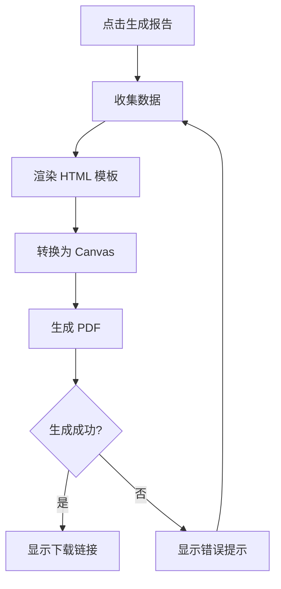

# Phase 3 v4.0 UI/UX 设计方案 (无 AI 版本)

**设计时间**: 2026-02-14
**设计师**: UI/UX Designer (ui-ux-designer-3)
**产品经理**: product-manager-4
**目标平台**: Web (响应式) + Mobile (PWA)
**设计系统**: 基于 design-tokens.ts 和 design-tokens-enhanced.ts
**状态**: ✅ Phase 3 v4.0 最终版本 (无 AI)

---

## 🎯 设计目标

### 1.1 用户目标

**成长追踪**:
- 快速记录孩子身高、体重、头围数据
- 可视化查看成长曲线对比 WHO 标准
- 自动接收里程碑提醒，不错过发育关键点
- 生成精美成长报告分享给家人

**社交分享**:
- 灵活控制相册分享权限和有效期
- 通过评论与家人互动交流
- 查看分享链接访问统计

**智能相册 (基于规则)**:
- 通过简单规则自动组织照片
- 减少手动整理照片的时间

### 1.2 业务目标

| 指标 | 当前值 | Phase 3 目标 | 测量方式 |
|------|--------|--------------|----------|
| 用户 30 天留存率 | - | 60% | 数据分析 |
| 成长数据录入率 | - | 50% | 功能使用统计 |
| 评论使用率 | - | 30% | 评论/照片统计 |
| 分享功能使用率 | - | 20% | 分享/家庭统计 |

---

## 📋 目录

1. [成长记录工具](#模块一成长记录工具)
2. [社交分享优化](#模块二社交分享优化)
3. [智能相册增强](#模块三智能相册增强基于规则)
4. [性能优化 UI](#模块四性能优化-ui)
5. [设计系统扩展](#设计系统扩展)
6. [响应式设计](#响应式设计)
7. [无障碍访问](#无障碍访问)
8. [开发交付清单](#开发交付清单)

---

## 模块一: 成长记录工具

### 功能 1.1: 成长曲线可视化

**工时**: 16h
**优先级**: P0 (Must)

#### 1.1.1 用户目标

- 快速录入孩子的身高、体重、头围数据
- 查看成长曲线对比 WHO 标准
- 了解孩子在同龄人中的发育水平
- 发现成长异常趋势

#### 1.1.2 页面结构设计

**成长曲线页面布局**:

```
+---------------------------------------------------------------+
|  Header: 成长记录                                        [设置] |
+---------------------------------------------------------------+
|  孩子选择器:  [宝宝1▼] [宝宝2] [宝宝3] [+ 添加]             |
|  时间范围:    [最近1月▼] [3月] [6月] [1年] [全部]            |
+---------------------------------------------------------------+
|                                                               |
|  +-----------------------------------------------------------+ |
|  |  指标选择:  [身高] [体重] [头围] (可多选)             | |
|  +-----------------------------------------------------------+ |
|                                                               |
|  +-----------------------------------------------------------+ |
|  |                                                           | |
|  |  ▲ 85th 百分位 (WHO 标准) - - - - - - - - - - -     | |
|  |                                                           | |
|  |     ▲ 50th 百分位 (WHO 标准) - - - - - - - - - - -    | |
|  |                                                           | |
|  |        ● 75 cm (2026-01-15)                            | |
|  |                                                           | |
|  |             ● 74 cm (2025-12-10)                         | |
|  |                                                           | |
|  |  ▼                                                           | |
|  |                                                           | |
|  +-----------------------------------------------------------+ |
|                                                               |
|  +-----------------------------------------------------------+ |
|  | 历史记录                            [+ 添加记录]             | |
|  |-----------------------------------------------------------| |
|  | 日期        | 身高  | 体重  | 头围  | 操作            | |
|  |-----------------------------------------------------------| |
|  | 2026-01-15 | 75 cm | 10.2kg| 45cm  | [编辑] [删除]  | |
|  | 2025-12-10 | 74 cm | 9.8kg | 44cm  | [编辑] [删除]  | |
|  | 2025-11-05 | 72 cm | 9.5kg | 43cm  | [编辑] [删除]  | |
|  +-----------------------------------------------------------+ |
|                                                               |
+---------------------------------------------------------------+
```

#### 1.1.3 组件拆分

**组件树结构**:

```
GrowthTrackingPage
├── ChildSelector
│   ├── ChildAvatar
│   └── ChildName
├── TimeRangeSelector
│   └── QuickRangeButtons
├── MetricSelector
│   └── MetricCheckbox (身高/体重/头围)
├── GrowthChart (Recharts)
│   ├── WHOStandardLines
│   ├── ChildDataLine
│   └── Tooltip
├── GrowthRecordList
│   ├── RecordItem
│   │   ├── DateDisplay
│   │   ├── MetricsDisplay
│   │   └── ActionButtons
│   └── AddRecordButton
└── AddRecordModal
    ├── MetricInput (身高)
    ├── MetricInput (体重)
    ├── MetricInput (头围)
    ├── DatePicker
    ├── NotesInput
    └── SubmitButton
```

**核心组件: GrowthChart**

**Props 接口**:

```typescript
interface GrowthChartProps {
  childId: string
  metrics: Array<'HEIGHT' | 'WEIGHT' | 'HEAD_CIRCUMFERENCE'>
  dateRange: { start: Date; end: Date }
  growthRecords: GrowthRecord[]
  whoStandards: WHOStandard[]
  onPointClick?: (record: GrowthRecord) => void
  onPointLongPress?: (record: GrowthRecord) => void
}
```

**状态管理**:

```typescript
interface GrowthChartState {
  selectedMetrics: Array<'HEIGHT' | 'WEIGHT' | 'HEAD_CIRCUMFERENCE'>
  dateRange: TimeRange
  hoveredDataPoint: GrowthRecord | null
  chartZoom: number
}
```

**交互设计**:

1. **数据录入交互**:
   - 点击 [+ 添加记录] 按钮 → 弹出添加记录模态框
   - 输入框: 实时验证 (身高 0-200cm，体重 0-100kg，头围 0-100cm)
   - 保存成功后 → 图表自动更新 + 显示成功提示

2. **图表交互**:
   - 点击数据点 → 显示详细信息卡片
   - 长按数据点 → 显示编辑/删除菜单
   - 捏合手势 → 图表缩放

3. **时间范围交互**:
   - 快速选择: [1月] [3月] [6月] [1年] [全部]
   - 自定义范围: 点击日期选择器

**样式要点**:

```css
/* 颜色方案 */
.height-line { stroke: #3B82F6; }  /* 蓝色 - 男孩 */
.weight-line { stroke: #10B981; }  /* 绿色 */
.head-circumference-line { stroke: #F59E0B; }  /* 橙色 */

.who-standard-line {
  stroke: #9CA3AF;
  stroke-dasharray: 5 5;  /* 虚线 */
  stroke-width: 1;
}

.child-data-line {
  stroke-width: 3;
  stroke-linecap: round;
}

.data-point {
  fill: #fff;
  stroke-width: 2;
  r: 5;
}

.data-point:hover {
  r: 8;
  cursor: pointer;
}
```

**响应式设计**:

```html
<div class="
  w-full                 <!-- Mobile: 全宽 -->
  md:w-11/12            <!-- Tablet: 91% -->
  lg:w-10/12            <!-- Desktop: 83% -->
  xl:w-3/4              <!-- Large: 75% -->
  mx-auto                <!-- 居中 -->
  p-4                   <!-- Mobile: 内边距 -->
  md:p-8                <!-- Tablet: 更大内边距 -->
">
```

---

### 功能 1.2: 成长报告生成

**工时**: 16h
**优先级**: P2 (Could)

#### 1.2.1 用户目标

- 生成精美的成长报告分享给家人
- 保存孩子成长回忆
- 支持不同节日主题

#### 1.2.2 页面结构设计

**成长报告生成页面**:

```
+---------------------------------------------------------------+
|  Header: 成长报告                                    [返回]     |
+---------------------------------------------------------------+
|                                                               |
|  1. 选择孩子:  [宝宝1▼]                                        |
|                                                               |
|  2. 选择模板:                                                  |
|     +-----------+  +-----------+  +-----------+                   |
|     | 默认      |  | 生日主题  |  | 新年主题  |                   |
|     | [预览图]  |  | [预览图]  |  | [预览图]  |                   |
|     +-----------+  +-----------+  +-----------+                   |
|                                                               |
|  3. 自定义设置:                                                |
|     [ ] 包含身高曲线                                            |
|     [✓] 包含体重曲线                                            |
|     [ ] 包含头围曲线                                            |
|     [✓] 包含里程碑时间线                                         |
|     [✓] 包含最近照片 (6张)                                       |
|     [✓] 包含数据摘要                                            |
|                                                               |
|  4. 预览报告:                                                 |
|     +-----------------------------------------------------------+ |
|     |                                                           | |
|     |  ┌─────────────────────────────────────────────┐              | |
|     |  │  宝宝1 成长报告                        │              | |
|     |  │  2026年1月                           │              | |
|     |  ├─────────────────────────────────────────────┤              | |
|     |  │  [照片1] [照片2] [照片3] ...           │              | |
|     |  │                                         │              | |
|     |  │  成长数据:                               │              | |
|     |  │  身高: 75 cm (75th 百分位)             │              | |
|     |  │  体重: 10.2 kg (70th 百分位)           │              | |
|     |  │                                         │              | |
|     |  │  [体重曲线图]                         │              | |
|     |  │                                         │              | |
|     |  │  里程碑:                                │              | |
|     |  │  • 2026-01-10: 第一次独立坐立             │              | |
|     |  │  • 2025-12-25: 第一次叫妈妈             │              | |
|     |  └─────────────────────────────────────────────┘              | |
|     |                                                           | |
|     +-----------------------------------------------------------+ |
|                                                               |
|  [取消]                                    [生成 PDF 报告]       |
|                                                               |
+---------------------------------------------------------------+
```

#### 1.2.3 组件拆分

**组件树结构**:

```
GrowthReportPage
├── ChildSelector
├── TemplateSelector
│   ├── TemplateCard
│   │   ├── TemplatePreview
│   │   └── TemplateName
│   └── CustomTemplateUpload
├── ReportSettings
│   ├── CheckboxGroup (曲线选择)
│   ├── Checkbox (包含照片)
│   └── PhotoCountInput
├── ReportPreview
│   └── ReportRenderer (Canvas/PDF)
└── ActionButtons
    ├── CancelButton
    └── GenerateButton
```

**核心组件: ReportRenderer**

**Props 接口**:

```typescript
interface ReportRendererProps {
  template: ReportTemplate
  child: Child
  growthRecords: GrowthRecord[]
  milestones: Milestone[]
  recentPhotos: Photo[]
  settings: ReportSettings
  onGenerate: () => void
}
```

**状态管理**:

```typescript
interface ReportRendererState {
  isGenerating: boolean
  generationProgress: number
  previewUrl: string | null
  error: string | null
}
```

**交互设计**:

1. **模板选择**:
   - 点击模板卡片 → 高亮选中
   - 显示预览图

2. **自定义设置**:
   - Checkbox 选择要包含的内容
   - 照片数量输入 (默认 6 张)

3. **生成报告**:
   - 点击 [生成 PDF 报告] 按钮
   - 显示 Loading 进度条
   - 生成成功后自动下载 PDF

**PDF 生成流程**:



---

### 功能 1.3: 里程碑提醒

**工时**: 12h
**优先级**: P0 (Must)

#### 1.3.1 用户目标

- 及时了解孩子发育里程碑
- 不错过记录重要时刻
- 获取科学的育儿建议

#### 1.3.2 页面结构设计

**里程碑提醒通知**:

```
+---------------------------------------------------------------+
|  通知列表: 成长提醒                              [全部标记已读] |
+---------------------------------------------------------------+
|                                                               |
|  +-----------------------------------------------------------+ |
|  |  📢 新提醒                                      [今天 10:30] | |
|  |-----------------------------------------------------------| |
|  |  您的宝宝 6 个月了，可以尝试坐立了！                     | |
|  |                                                           | |
|  |  预置里程碑: WHO 大运动发育标准                        | |
|  |                                                           | |
|  |  [查看详情]                          [记录里程碑] [忽略]  | |
|  +-----------------------------------------------------------+ |
|                                                               |
|  +-----------------------------------------------------------+ |
|  |  📢 已提醒                                    [昨天 15:20] | |
|  |-----------------------------------------------------------| |
|  |  您的宝宝 4 个月了，可能开始长牙了                       | |
|  |                                                           | |
|  |  预置里程碑: WHO 健康发育标准                        | |
|  |                                                           | |
|  |  [查看详情]                          [已记录]            | |
|  +-----------------------------------------------------------+ |
|                                                               |
|  +-----------------------------------------------------------+ |
|  |  📢 已忽略                                    [2天前 09:00] | |
|  |-----------------------------------------------------------| |
|  |  您的宝宝 3 个月了，可以尝试抬头了                       | |
|  |                                                           | |
|  |  [重新激活]                                             | |
|  +-----------------------------------------------------------+ |
|                                                               |
+---------------------------------------------------------------+
```

**里程碑记录页面**:

```
+---------------------------------------------------------------+
|  Header: 里程碑记录                                    [返回]     |
+---------------------------------------------------------------+
|                                                               |
|  孩子选择:  [宝宝1▼]                                           |
|                                                               |
|  +-----------------------------------------------------------+ |
|  |  分类筛选:  [全部] [大运动] [精细动作] [语言] [社交]    | |
|  +-----------------------------------------------------------+ |
|                                                               |
|  +-----------------------------------------------------------+ |
|  |  里程碑时间线                                            | |
|  |-----------------------------------------------------------| |
|  |                                                           | |
|  |  ●━━━━━━━━━━━━━━━━━━━━━━━━━━━━━━━━━━━━━━━     | |
|  |       2026-01-10                                         | |
|  |                                                           | |
|  |  ┌─────────────────────────────────────┐                    | |
|  |  │ 🎯 第一次独立坐立                  │                    | |
|  |  │ 2026-01-10                       │                    | |
|  |  │ [照片: 宝宝坐立照片]             │                    | |
|  |  │ 备注: 宝宝可以独立坐立30秒了       │                    | |
|  |  │                                        [编辑] [删除]  │                    | |
|  |  └─────────────────────────────────────┘                    | |
|  |                                                           | |
|  |  ●━━━━━━━━━━━━━━━━━━━━━━━━━━━━━━━━━━━━━━━     | |
|  |       2025-12-25                                         | |
|  |                                                           | |
|  |  ┌─────────────────────────────────────┐                    | |
|  |  │ 🗣️ 第一次叫妈妈                    │                    | |
|  |  │2025-12-25                        │                    | |
|  |  │ [照片: 宝宝微笑照片]              │                    | |
|  |  │ 备注: 清晰地叫出"妈妈"           │                    | |
|  |  │                                        [编辑] [删除]  │                    | |
|  |  └─────────────────────────────────────┘                    | |
|  |                                                           | |
|  +-----------------------------------------------------------+ |
|                                                               |
|  [+ 记录新里程碑]                                             |
|                                                               |
+---------------------------------------------------------------+
```

#### 1.3.3 组件拆分

**组件树结构**:

```
MilestoneReminderList
├── ReminderFilter
│   └── FilterTabs (新提醒/已提醒/已忽略)
├── ReminderItem
│   ├── ReminderHeader
│   │   ├── NotificationIcon
│   │   └── Timestamp
│   ├── ReminderContent
│   │   ├── MilestoneTitle
│   │   ├── MilestoneDescription
│   │   └── WHOStandardBadge
│   └── ActionButtons
│       ├── ViewDetailButton
│       ├── RecordMilestoneButton
│       └── DismissButton
└── MarkAllReadButton

MilestoneRecordPage
├── ChildSelector
├── CategoryFilter
│   └── FilterTabs (全部/大运动/精细动作/语言/社交)
├── MilestoneTimeline
│   └── MilestoneCard
│       ├── MilestoneIcon
│       ├── MilestoneDate
│       ├── MilestoneTitle
│       ├── MilestonePhoto
│       ├── MilestoneNotes
│       └── ActionButtons
└── AddMilestoneButton
    └── AddMilestoneModal
```

**核心组件: MilestoneTimeline**

**Props 接口**:

```typescript
interface MilestoneTimelineProps {
  childId: string
  category?: 'ALL' | 'GROSS_MOTOR' | 'FINE_MOTOR' | 'LANGUAGE' | 'SOCIAL'
  milestones: Milestone[]
  onEdit: (milestone: Milestone) => void
  onDelete: (milestoneId: string) => void
  onAdd: () => void
}
```

**交互设计**:

1. **提醒通知**:
   - 新提醒: 蓝色边框高亮
   - 点击 [记录里程碑] → 打开记录模态框
   - 点击 [忽略] → 移动到"已忽略"列表

2. **时间线展示**:
   - 垂直时间线布局
   - 里程碑卡片按时间倒序
   - 关联照片和备注

3. **添加里程碑**:
   - 点击 [+ 记录新里程碑] 按钮
   - 填写标题、日期、照片、备注
   - 保存后添加到时间线

---

## 模块二: 社交分享优化

### 功能 2.1: 照片评论系统

**工时**: 20h
**优先级**: P1 (Should)

#### 2.1.1 用户目标

- 对照片发表评论
- 与家人互动交流
- 回复其他家庭成员的评论

#### 2.1.2 页面结构设计

**照片详情页 - 评论区域**:

```
+---------------------------------------------------------------+
|  照片详情                                                    |
+---------------------------------------------------------------+
|  [返回]                                              [分享]   |
|                                                               |
|  +-----------------------------------------------------------+ |
|  |                                                           | |
|  |                                                       [照片] | |
|  |                                                           | |
|  +-----------------------------------------------------------+ |
|                                                               |
|  照片信息: 2026-01-10  公园     [编辑] [删除]                   |
|                                                               |
|  评论 (3)                                          [查看全部]   |
|  +-----------------------------------------------------------+ |
|  |                                                           | |
|  |  ┌─────────────────────────────────────────────────────────┐    | |
|  |  │ 👤 妈妈                                        [3s前] |    | |
|  |  │ │ 宝宝今天真可爱！                              │    | |
|  |  │ └───────────────────────────────────────────────┘    | |
|  |  │                                                  [❤️ 2] [回复] |    | |
|  |  │                                                      │    | |
|  |  │ ┌────────────────────────────────────────────────┐    | |
|  |  │ │ 👤 爸爸                                [2s前]    |    | |
|  |  │ │ 是啊，非常开心！                           │    | |
|  |  │ └────────────────────────────────────────────────┘    | |
|  |  └─────────────────────────────────────────────────────────┘    | |
|  |                                                           | |
|  |  ┌─────────────────────────────────────────────────────────┐    | |
|  |  │ 👤 爷爷                                      [1天前] |    | |
|  |  │ 宝宝长大了，跟爷爷一样英俊！               │    | |
|  |  │                                                  [❤️ 1] [回复] |    | |
|  |  └─────────────────────────────────────────────────────────┘    | |
|  |                                                           | |
|  +-----------------------------------------------------------+ |
|                                                               |
|  ┌─────────────────────────────────────────────────────────┐      |
|  │ [用户头像]  [写评论...]                              [发送] |      |
|  └─────────────────────────────────────────────────────────┘      |
|  [😊] [@] [#]                                               |
|                                                               |
+---------------------------------------------------------------+
```

**评论列表展开**:

```
+---------------------------------------------------------------+
|  全部评论 (12)                                                   |
+---------------------------------------------------------------+
|                                                               |
|  ┌─────────────────────────────────────────────────────────┐      |
|  │ 👤 妈妈                                        [3s前]      | |
|  │ 宝宝今天真可爱！                                   │      |
|  │                                                  [❤️ 2] [回复] |      |
|  │ ┌────────────────────────────────────────────────┐    |      |
|  │ │ 👤 爸爸                                [2s前]    |      |
|  │ │ 是啊，非常开心！                           │    |      |
|  │ │                                                  [❤️] [回复] |    |      |
|  │ └────────────────────────────────────────────────┘    |      |
|  │ ┌────────────────────────────────────────────────┐    |      |
|  | │ 👤 妈妈                                [1s前]    |      |
|  | │ 我们要去公园玩了！                         │    |      |
|  | └────────────────────────────────────────────────┘    |      |
|  └─────────────────────────────────────────────────────────┘      |
|                                                               |
|  [加载更多...]                                                   |
|                                                               |
+---------------------------------------------------------------+
```

#### 2.1.3 组件拆分

**组件树结构**:

```
PhotoCommentSection
├── CommentHeader
│   ├── CommentCount
│   └── ViewAllCommentsButton
├── CommentList
│   ├── CommentItem
│   │   ├── UserAvatar
│   │   ├── UserName
│   │   ├── Timestamp
│   │   ├── CommentContent (XSS-safe)
│   │   ├── ActionButtons
│   │   │   ├── LikeButton
│   │   │   └── ReplyButton
│   │   └── ReplyList
│   │       └── CommentReply
│   │           ├── UserAvatar
│   │           ├── UserName
│   │           ├── Timestamp
│   │           ├── ReplyContent
│   │           └── ActionButtons
│   └── LoadMoreButton
├── CommentInput
│   ├── UserAvatar
│   ├── TextInput
│   ├── EmojiPickerButton
│   ├── MentionButton (@)
│   └── SubmitButton
└── EmojiPicker
    └── EmojiGrid
```

**核心组件: CommentItem**

**Props 接口**:

```typescript
interface CommentItemProps {
  comment: PhotoComment
  photoId: string
  currentUserId: string
  onLike: (commentId: string) => void
  onReply: (commentId: string) => void
  onDelete: (commentId: string) => void
  onEdit: (commentId: string, newContent: string) => void
}

interface CommentReplyProps {
  reply: PhotoComment
  parentId: string
  currentUserId: string
  onLike: (replyId: string) => void
  onReply: (replyId: string) => void
  onDelete: (replyId: string) => void
}
```

**状态管理**:

```typescript
interface CommentInputState {
  content: string
  isSubmitting: boolean
  mentionedUsers: string[]
  selectedEmoji: string | null
}

interface CommentItemState {
  isLiked: boolean
  likeCount: number
  isReplying: boolean
  replyTo: string | null
  showReplyList: boolean
}
```

**交互设计**:

1. **发表评论**:
   - 输入框实时字数统计 (1-500 字符)
   - 点击 [😊] → 弹出 Emoji 选择器
   - 输入 @ → 触发用户提及选择器
   - 点击 [发送] → 显示 Loading 状态 → 评论实时添加到列表

2. **回复评论**:
   - 点击 [回复] → 切换到回复模式
   - 输入框显示: "回复 @用户名:"
   - 提交后回复显示在评论下方

3. **点赞互动**:
   - 点击 ❤️ → 点赞数 +1，按钮高亮
   - 再次点击 → 取消点赞

4. **实时更新**:
   - 使用 WebSocket 接收新评论
   - 新评论自动插入列表顶部
   - 显示"xxx 发表了新评论"提示

**XSS 防护**:

```typescript
// 评论内容必须经过 XSS 过滤
import DOMPurify from 'dompurify'

const renderCommentContent = (content: string) => {
  const clean = DOMPurify.sanitize(content, {
    ALLOWED_TAGS: ['b', 'i', 'em', 'strong', 'a'],
    ALLOWED_ATTR: ['href']
  })
  return <span dangerouslySetInnerHTML={{ __html: clean }} />
}
```

---

### 功能 2.2: 社交分享优化

**工时**: 16h
**优先级**: P1 (Should)

#### 2.2.1 用户目标

- 分享相册给亲友查看
- 灵活控制分享权限和有效期
- 查看分享链接访问统计

#### 2.2.2 页面结构设计

**分享对话框**:

```
+---------------------------------------------------------------+
|  ┌─────────────────────────────────────────────────────────┐      |
|  │  分享相册 "宝宝1岁生日派对"                           [✕]   |      |
|  ├─────────────────────────────────────────────────────────┤      |
|  │                                                         |      |
|  │  1. 分享方式:                                          |      |
|  │     ◉ 公开链接 (无需登录)                                |      |
|  │     ○ 私密分享 (需要密码)                               |      |
|  │                                                         |      |
|  │  2. 权限设置:                                          |      |
|  │     [✓] 允许查看                                        |      |
|  │     [✓] 允许评论                                        |      |
|  │     [ ] 允许下载                                        |      |
|  │                                                         |      |
|  │  3. 有效期设置:                                          |      |
|  │     ◉ 7天后过期                                          |      |
|  │     ○ 30天后过期                                         |      |
|  │     ○ 永久有效                                           |      |
|  │                                                         |      |
|  │  4. 访问密码 (可选):                                    |      |
|  │     ┌──────────────────────┐                               |      |
|  │     │ •••••••••          │ [👁️ 显示] [重新生成]    |      |
|  │     └──────────────────────┘                               |      |
|  │     密码强度: 强 (8位，字母+数字)                          |      |
|  │                                                         |      |
|  │  5. 分享链接:                                          |      |
|  │     ┌──────────────────────────────────┐                   |      |
|  │     │ https://baby.photo/share/abc123 │ [复制] [二维码]   |      |
|  │     └──────────────────────────────────┘                   |      |
|  │                                                         |      |
|  │  [取消]                              [创建分享链接]        |      |
|  └─────────────────────────────────────────────────────────┘      |
+---------------------------------------------------------------+
```

**分享成功对话框**:

```
+---------------------------------------------------------------+
|  ┌─────────────────────────────────────────────────────────┐      |
|  │  分享成功！                                           [✕]   |      |
|  ├─────────────────────────────────────────────────────────┤      |
|  │                                                         |      |
|  │  分享链接已创建，有效期7天                             |      |
|  │                                                         |      |
|  │  ┌──────────────────────────────────────┐               |      |
|  │  │                                      │               |      |
|  │  │           [QR 码图片]                  │               |      |
|  │  │                                      │               |      |
|  │  │                                      │               |      |
|  │  └──────────────────────────────────────┘               |      |
|  │                                                         |      |
|  │  ┌────────────────────────────────────────────────┐        |      |
|  │  │ https://baby.photo/share/abc123    [复制]    │        |      |
|  │  └────────────────────────────────────────────────┘        |      |
|  │                                                         |      |
|  │  [分享到微信] [分享到朋友圈] [下载二维码]                |      |
|  │                                                         |      |
|  │  [管理分享] (查看访问统计)                                |      |
|  │                                                         |      |
|  │                                          [关闭]        |      |
|  └─────────────────────────────────────────────────────────┘      |
+---------------------------------------------------------------+
```

**访问统计页面**:

```
+---------------------------------------------------------------+
|  Header: 访问统计 - "宝宝1岁生日派对"                      [返回] |
+---------------------------------------------------------------+
|                                                               |
|  分享链接: https://baby.photo/share/abc123        [复制] [撤销]  |
|  有效期: 2026-02-21 过期 (剩余7天)                             |
|                                                               |
|  +-----------------------------------------------------------+ |
|  |  概览                                          [过去7天▼] | |
|  |-----------------------------------------------------------| |
|  |  📊 访问次数: 156 次                                  | |
|  |  👥 访客人数: 42 人                                    | |
|  |  💬 评论数量: 23 条                                    | |
|  +-----------------------------------------------------------+ |
|                                                               |
|  +-----------------------------------------------------------+ |
|  |  访问趋势图表                                          | |
|  |-----------------------------------------------------------| |
|  |  ▲                                                        | |
|  │  ●━━━━━━━━━●━━━━━━━━━●━━━━━━━━━●━━━━━━━━━           | |
|  │                                  (折线图)               | |
|  │  ▼                                                        | |
|  +-----------------------------------------------------------+ |
|                                                               |
|  +-----------------------------------------------------------+ |
|  |  最近访客                                    [查看全部]     | |
|  |-----------------------------------------------------------| |
|  |  👤 张三                                            [今天] | |
|  |  👤 李四                                            [昨天] | |
|  |  👤 王五                                            [2天前] | |
|  +-----------------------------------------------------------+ |
|                                                               |
+---------------------------------------------------------------+
```

#### 2.2.3 组件拆分

**组件树结构**:

```
ShareDialog
├── ShareModeSelector
│   ├── PublicModeRadio
│   └── PrivateModeRadio
├── PermissionSettings
│   ├── Checkbox (允许查看)
│   ├── Checkbox (允许评论)
│   └── Checkbox (允许下载)
├── ExpirationSelector
│   ├── QuickOptions (7天/30天/永久)
│   └── DatePicker
├── PasswordField
│   ├── PasswordInput
│   ├── PasswordStrengthIndicator
│   ├── ShowPasswordButton
│   └── RegenerateButton
├── ShareLinkDisplay
│   ├── LinkInput
│   ├── CopyButton
│   └── QRCodeButton
└── ActionButtons
    ├── CancelButton
    └── CreateShareButton

ShareSuccessDialog
├── SuccessMessage
├── QRCodeDisplay
│   ├── QRCodeImage
│   └── DownloadQRButton
├── ShareLinkDisplay
│   ├── LinkText
│   └── CopyButton
├── SocialShareButtons
│   ├── WeChatButton
│   ├── MomentsButton
│   └── DownloadQRButton
└── CloseButton

AccessStatsPage
├── ShareLinkHeader
│   ├── LinkDisplay
│   ├── ExpirationDisplay
│   └── ActionButtons (复制/撤销)
├── StatsOverview
│   ├── ViewCountCard
│   ├── VisitorCountCard
│   └── CommentCountCard
├── AccessTrendChart (Recharts)
└── RecentVisitorsList
    └── VisitorItem
```

**核心组件: PasswordStrengthIndicator**

**Props 接口**:

```typescript
interface PasswordStrengthIndicatorProps {
  password: string
  minLength?: number
  requireLettersAndNumbers?: boolean
}

interface StrengthLevel {
  score: number  // 0-100
  level: 'WEAK' | 'MEDIUM' | 'STRONG' | 'VERY_STRONG'
  color: string
  text: string
}
```

**状态管理**:

```typescript
interface ShareDialogState {
  shareMode: 'PUBLIC' | 'PRIVATE'
  permissions: {
    allowView: boolean
    allowComment: boolean
    allowDownload: boolean
  }
  expiration: '7_DAYS' | '30_DAYS' | 'NEVER'
  password: string
  isGenerating: boolean
  shareToken: string | null
}
```

**交互设计**:

1. **创建分享链接**:
   - 选择分享方式 (公开/私密)
   - 勾选权限设置
   - 选择有效期
   - 如选私密分享 → 生成 8 位随机密码 (字母+数字)
   - 点击 [创建分享链接] → Loading 状态 → 显示成功对话框

2. **密码强度**:
   - 弱: 红色 (0-40分)
   - 中: 黄色 (41-70分)
   - 强: 绿色 (71-90分)
   - 很强: 深绿色 (91-100分)

3. **访问统计**:
   - 实时更新访问次数
   - 折线图展示访问趋势
   - 最近访客列表

---

## 模块三: 智能相册增强 (基于规则)

### 功能 3.1: 基于规则的智能相册

**工时**: 40h
**优先级**: P2 (Could)

#### 3.1.1 用户目标

- 通过规则自动组织照片
- 减少手动整理照片时间
- 快速找到特定照片

#### 3.1.2 页面结构设计

**智能规则构建器**:

```
+---------------------------------------------------------------+
|  Header: 创建智能相册                                   [返回]    |
+---------------------------------------------------------------+
|                                                               |
|  1. 相册名称:                                                  |
|     ┌──────────────────────────────────────┐                        |
|     │ 2024年1月照片                          │                |
|     └──────────────────────────────────────┘                        |
|                                                               |
|  2. 筛选规则:                                                  |
|     ┌─────────────────────────────────────────────────────────────┐  |
|     │  规则组 1                                   [删除组]   │  |
|     │  ┌──────────────────────────────────────────────────┐     │  |
|     │  │ 条件:  满足以下所有条件 (AND)          │     │  |
|     │  │                                                │     │  |
|     │  │  [+ 添加条件]                    [匹配规则▼]  │     │  |
|     │  │                                                │     │  |
|     │  │  条件 1:  日期范围                             │     │  |
|     │  │           ┌────────────────────┐                │     │  |
|     │  │           │ 2024-01-01      │  至            │     │  |
|     │  │           └────────────────────┘                │     │  |
|     │  │           ┌────────────────────┐                │     │  |
|     │  │           │ 2024-01-31      │                │     │  |
|     │  │           └────────────────────┘                │     │  |
|     │  │           [删除条件]                              │     │  |
|     │  └──────────────────────────────────────────────────┘     │  |
|     └─────────────────────────────────────────────────────────────┘  |
|                                                               |
|     [+ 添加规则组]                                               |
|                                                               |
|  3. 自动更新设置:                                              |
|     [✓] 新照片自动匹配规则并添加到相册                          |
|     [✓] 相册封面自动更新为最新照片                              |
|                                                               |
|  4. 预览结果:                                                  |
|     预计包含 156 张照片                                          |
|     [预览照片]                                                   |
|                                                               |
|  [取消]                                        [创建智能相册]    |
|                                                               |
+---------------------------------------------------------------+
```

**规则条件选择器**:

```
+---------------------------------------------------------------+
|  选择条件类型:                                                  |
|     ┌─────────────────┐  ┌─────────────────┐               |
|     │  日期范围      │  │  标签包含      │               |
|     └─────────────────┘  └─────────────────┘               |
|     ┌─────────────────┐  ┌─────────────────┐               |
|     │  拍摄地点      │  │  人物包含      │               |
|     └─────────────────┘  └─────────────────┘               |
|     ┌─────────────────┐  ┌─────────────────┐               |
|     │  上传时间      │  │  收藏状态      │               |
|     └─────────────────┘  └─────────────────┘               |
+---------------------------------------------------------------+
```

**智能相册管理页面**:

```
+---------------------------------------------------------------+
|  Header: 智能相册                                    [+ 创建]    |
+---------------------------------------------------------------+
|  筛选:  [全部] [手动创建] [自动生成]                             |
|                                                               |
|  +-----------------------------------------------------------+ |
|  |  相册卡片 (网格布局)                               | |
|  |-----------------------------------------------------------| |
|  |  ┌──────────────────┐  ┌──────────────────┐           | |
|  |  │ [封面照片]      │  │ [封面照片]      │           | |
|  |  │                  │  │                  │           | |
|  |  │ 2024年1月照片   │  │ 宝宝3岁生日     │           | |
|  |  │ 156 张照片      │  │ 42 张照片       │           | |
|  |  │ 🤖 自动更新     │  │ 🤖 自动更新     │           | |
|  |  │ [查看] [编辑规则]│  │ [查看] [编辑规则]│           | |
|  |  └──────────────────┘  └──────────────────┘           | |
|  |                                                       | |
|  |  ┌──────────────────┐  ┌──────────────────┐           | |
|  |  │ [封面照片]      │  │ [封面照片]      │           | |
|  |  │                  │  │                  │           | |
|  |  │ 春节2024        │  │ 公园游玩        │           | |
|  |  │ 78 张照片      │  │ 23 张照片       │           | |
|  |  │ 🤖 自动更新     │  │ 📝 手动创建     │           | |
|  |  │ [查看] [编辑规则]│  │ [查看] [编辑]   │           | |
|  |  └──────────────────┘  └──────────────────┘           | |
|  |                                                       | |
|  +-----------------------------------------------------------+ |
|                                                               |
+---------------------------------------------------------------+
```

#### 3.1.3 组件拆分

**组件树结构**:

```
SmartAlbumBuilder
├── AlbumNameInput
├── RuleGroupList
│   └── RuleGroup
│       ├── GroupHeader
│       ├── ConditionSelector (AND/OR)
│       ├── ConditionList
│       │   └── ConditionItem
│       │       ├── ConditionTypeSelect
│       │       ├── DateRangeCondition
│       │       ├── TagCondition
│       │       ├── LocationCondition
│       │       └── PersonCondition
│       └── DeleteGroupButton
├── AddConditionButton
├── AutoUpdateSettings
│   ├── Checkbox (自动匹配)
│   └── Checkbox (自动更新封面)
└── PreviewSection
    ├── PhotoCountDisplay
    └── PreviewPhotosGrid

SmartAlbumListPage
├── FilterTabs (全部/手动/自动)
├── SmartAlbumGrid
│   └── SmartAlbumCard
│       ├── AlbumCoverPhoto
│       ├── AlbumName
│       ├── PhotoCount
│       ├── AutoUpdateBadge
│       └── ActionButtons
│           ├── ViewButton
│           └── EditRulesButton
└── CreateAlbumButton
```

**核心组件: RuleGroup**

**Props 接口**:

```typescript
interface RuleGroupProps {
  groupId: string
  conditions: Condition[]
  logicOperator: 'AND' | 'OR'
  onUpdateConditions: (groupId: string, conditions: Condition[]) => void
  onDeleteGroup: (groupId: string) => void
}

interface Condition {
  id: string
  type: 'DATE_RANGE' | 'TAG' | 'LOCATION' | 'PERSON' | 'FAVORITE' | 'UPLOAD_TIME'
  operator: 'EQUALS' | 'CONTAINS' | 'BETWEEN' | 'IN'
  value: any
}

interface ConditionProps {
  condition: Condition
  onUpdate: (condition: Condition) => void
  onDelete: (conditionId: string) => void
}
```

**交互设计**:

1. **添加规则条件**:
   - 点击 [+ 添加条件] → 弹出条件类型选择器
   - 选择类型 → 显示对应的输入组件
   - 日期范围: 选择器选择起止日期
   - 标签包含: 下拉选择已有标签或输入新标签
   - 地点: 下拉选择已有地点或输入新地点

2. **规则组合**:
   - 选择"满足以下所有条件 (AND)" → 所有条件都满足
   - 选择"满足任一条件 (OR)" → 任一条件满足

3. **自动更新**:
   - 勾选 [新照片自动匹配规则] → 后台定时任务扫描新照片
   - 勾选 [相册封面自动更新] → 最新照片作为封面

---

## 模块四: 性能优化 UI

### 功能 4.1: 虚拟滚动优化

**工时**: 8h
**优先级**: P1 (Should)

#### 4.1.1 优化目标

- 大量照片列表流畅滚动
- 减少 DOM 节点数量
- 提升页面加载速度

#### 4.1.2 技术实现

**使用 @tanstack/virtual**:

```typescript
import { useVirtualizer } from '@tanstack/react-virtual'

function PhotoGrid({ photos }: { photos: Photo[] }) {
  const parentRef = useRef<HTMLDivElement>(null)

  const virtualizer = useVirtualizer({
    count: photos.length,
    getScrollElement: () => parentRef.current,
    estimateSize: () => 200,  // 估算每张照片高度
    overscan: 5,  // 预加载 5 页数据
  })

  return (
    <div ref={parentRef} className="h-screen overflow-auto">
      <div
        style={{
          height: `${virtualizer.getTotalSize()}px`,
          width: '100%',
          position: 'relative',
        }}
      >
        {virtualizer.getVirtualItems().map((virtualItem) => {
          const photo = photos[virtualItem.index]
          return (
            <div
              key={virtualItem.key}
              style={{
                position: 'absolute',
                top: 0,
                left: 0,
                width: '100%',
                height: `${virtualItem.size}px`,
                transform: `translateY(${virtualItem.start}px)`,
              }}
            >
              <PhotoCard photo={photo} />
            </div>
          )
        })}
      </div>
    </div>
  )
}
```

---

### 功能 4.2: 图片懒加载

**工时**: 6h
**优先级**: P1 (Should)

#### 4.2.1 优化目标

- 优先加载视口内图片
- 渐进式加载体验
- 减少初始加载流量

#### 4.2.2 技术实现

**使用 Intersection Observer API**:

```typescript
function LazyImage({ src, alt, placeholder }: LazyImageProps) {
  const [imageSrc, setImageSrc] = useState(placeholder)
  const [isLoaded, setIsLoaded] = useState(false)
  const imgRef = useRef<HTMLImageElement>(null)

  useEffect(() => {
    const observer = new IntersectionObserver(
      (entries) => {
        entries.forEach((entry) => {
          if (entry.isIntersecting) {
            setImageSrc(src)
            observer.disconnect()
          }
        })
      },
      { rootMargin: '100px' }  // 提前 100px 加载
    )

    if (imgRef.current) {
      observer.observe(imgRef.current)
    }

    return () => observer.disconnect()
  }, [src])

  return (
     setIsLoaded(true)}
    />
  )
}
```

**渐进式加载效果**:

```css
/* 模糊 → 清晰 */
.lazy-image {
  filter: blur(10px);
  transition: filter 0.3s ease;
}

.lazy-image.loaded {
  filter: blur(0);
}
```

---

### 功能 4.3: 缓存优化

**工时**: 6h
**优先级**: P1 (Should)

#### 4.3.1 优化目标

- 减少 API 请求次数
- 提升响应速度
- 降低服务器负载

#### 4.3.2 技术实现

**React Query 缓存配置**:

```typescript
const queryClient = new QueryClient({
  defaultOptions: {
    queries: {
      staleTime: 5 * 60 * 1000,  // 5 分钟内数据视为新鲜
      cacheTime: 10 * 60 * 1000,  // 缓存保留 10 分钟
      refetchOnWindowFocus: false,  // 窗口聚焦时不自动重新获取
    },
  },
})
```

**Query Key 设计规范**:

```typescript
// 单个孩子成长数据
export const growthRecordsKeys = {
  all: ['growthRecords'] as const,
  lists: () => [...growthRecordsKeys.all, 'list'] as const,
  list: (childId: string, dateRange: DateRange) =>
    [...growthRecordsKeys.lists(), childId, dateRange] as const,
}

// 照片列表
export const photosKeys = {
  all: ['photos'] as const,
  lists: () => [...photosKeys.all, 'list'] as const,
  list: (filters: PhotoFilters) =>
    [...photosKeys.lists(), filters] as const,
}

// 评论列表
export const commentsKeys = {
  all: ['comments'] as const,
  lists: () => [...commentsKeys.all, 'list'] as const,
  list: (photoId: string) =>
    [...commentsKeys.lists(), photoId] as const,
}
```

---

## 设计系统扩展

### 颜色方案

**主色调**:

```css
/* 成长曲线 */
.height-color: #3B82F6    /* 蓝色 - 男孩 */
.weight-color: #10B981    /* 绿色 */
.head-circumference-color: #F59E0B  /* 橙色 */

/* 社交分享 */
.share-link-color: #8B5CF6  /* 紫色 */
.comment-color: #EC4899    /* 粉色 */
.like-color: #F43F5E      /* 红色 */

/* 状态颜色 */
.success: #10B981
.warning: #F59E0B
.error: #EF4444
.info: #3B82F6
```

**渐变色**:

```css
/* 成长报告渐变 */
.report-gradient-primary: linear-gradient(135deg, #667eea 0%, #764ba2 100%);
.report-gradient-birthday: linear-gradient(135deg, #f093fb 0%, #f5576c 100%);
.report-gradient-newyear: linear-gradient(135deg, #fa709a 0%, #fee140 100%);
```

### 字体排版

```css
/* 标题 */
h1: font-size: 2.25rem (36px), font-weight: 700
h2: font-size: 1.875rem (30px), font-weight: 600
h3: font-size: 1.5rem (24px), font-weight: 600

/* 正文 */
body: font-size: 1rem (16px), line-height: 1.5
small: font-size: 0.875rem (14px)

/* 数据展示 */
data-large: font-size: 2.5rem (40px), font-weight: 700, color: primary
data-medium: font-size: 1.5rem (24px), font-weight: 600
data-small: font-size: 1rem (16px), font-weight: 500
```

### 间距系统

```
xs:  4px  (p-1)
sm:  8px  (p-2)
md:  16px (p-4)
lg:  24px (p-6)
xl:  32px (p-8)
2xl: 48px (p-12)
```

---

## 响应式设计

### 断点策略

| 屏幕尺寸 | Breakpoint | 布局调整 |
|----------|------------|----------|
| Mobile | < 640px | 单列布局，全宽 |
| Tablet | 640px - 1023px | 双列布局，卡片宽度 80% |
| Desktop | ≥ 1024px | 三列布局，最大宽度 1200px |

### 移动端优化

- **触摸友好**: 按钮最小尺寸 44x44px
- **键盘优化**:
  - 日期输入: `type="date"` 触发日期选择器
  - 数字输入: `type="number"` 触发数字键盘
  - 邮箱输入: `type="email"` 触发邮箱键盘
- **滚动优化**: 避免横向滚动，使用 `overflow-x: hidden`

### 响应式示例

```html
<!-- 照片网格 -->
<div class="
  grid                       <!-- Grid 布局 -->
  grid-cols-1               <!-- Mobile: 1 列 -->
  sm:grid-cols-2            <!-- Tablet: 2 列 -->
  md:grid-cols-3            <!-- Desktop: 3 列 -->
  lg:grid-cols-4            <!-- Large: 4 列 -->
  gap-4                     <!-- 间距 16px -->
  p-4                       <!-- Mobile: 内边距 -->
  sm:p-6                    <!-- Tablet: 内边距 24px -->
">
  <!-- 照片卡片 -->
</div>
```

---

## 无障碍访问

### A11y 关键实践

| 实践 | 实施方法 | 示例 |
|------|----------|------|
| 语义化 HTML | 使用正确的 HTML 标签 | `<button>` 而非 `<div onclick>` |
| 键盘导航 | 确保所有交互可用 Tab 导航 | `tabindex` 顺序逻辑 |
| 屏幕阅读器 | 使用 ARIA 属性 | `aria-label`, `aria-describedby` |
| 颜色对比度 | WCAG AA 标准 (4.5:1) | 文字 vs 背景对比度检查 |
| 焦点可见 | 显示焦点环 | `focus:ring-2 focus:ring-blue-500` |

### 表单 A11y 示例

```html
<form>
  <!-- 使用 label + for 关联 -->
  <label for="height" class="block text-sm font-medium">
    身高 (cm)
  </label>
  <input
    id="height"
    type="number"
    required
    aria-describedby="height-error"
    aria-invalid="false"
    class="..."
  />

  <!-- 错误提示使用 aria-live -->
  <p
    id="height-error"
    role="alert"
    aria-live="polite"
    class="text-red-600 text-sm mt-1"
  >
    请输入有效的身高 (0-200cm)
  </p>

  <!-- 按钮使用 aria-label 描述状态 -->
  <button
    type="submit"
    aria-label="提交成长记录"
    aria-disabled="false"
    class="..."
  >
    保存记录
  </button>
</form>
```

---

## 开发交付清单

### 模块一: 成长记录工具 (44h)

- [ ] 成长曲线可视化
  - [ ] ChildSelector 组件
  - [ ] TimeRangeSelector 组件
  - [ ] MetricSelector 组件
  - [ ] GrowthChart 组件 (Recharts)
  - [ ] GrowthRecordList 组件
  - [ ] AddRecordModal 组件
  - [ ] WHO 标准曲线数据集成
  - [ ] 响应式布局
  - [ ] A11y 优化

- [ ] 成长报告生成
  - [ ] TemplateSelector 组件
  - [ ] ReportSettings 组件
  - [ ] ReportPreview 组件
  - [ ] PDF 生成服务 (jsPDF)
  - [ ] 模板设计 (默认/生日/新年)
  - [ ] 自定义模板上传

- [ ] 里程碑提醒
  - [ ] ReminderList 组件
  - [ ] ReminderItem 组件
  - [ ] MilestoneRecordPage 组件
  - [ ] MilestoneTimeline 组件
  - [ ] AddMilestoneModal 组件
  - [ ] WHO 里程碑数据集成
  - [ ] 提醒通知服务

### 模块二: 社交分享优化 (36h)

- [ ] 照片评论系统
  - [ ] CommentList 组件
  - [ ] CommentItem 组件
  - [ ] CommentInput 组件
  - [ ] EmojiPicker 组件
  - [ ] MentionSelector 组件
  - [ ] XSS 防护 (DOMPurify)
  - [ ] WebSocket 实时更新
  - [ ] 点赞功能

- [ ] 社交分享优化
  - [ ] ShareDialog 组件
  - [ ] ShareModeSelector 组件
  - [ ] PermissionSettings 组件
  - [ ] ExpirationSelector 组件
  - [ ] PasswordField 组件
  - [ ] PasswordStrengthIndicator 组件
  - [ ] QRCode 生成器
  - [ ] AccessStatsPage 组件
  - [ ] 访问统计图表

### 模块三: 智能相册增强 (40h)

- [ ] 基于规则的智能相册
  - [ ] SmartAlbumBuilder 组件
  - [ ] RuleGroup 组件
  - [ ] ConditionItem 组件
  - [ ] ConditionSelector (多种类型)
  - [ ] AutoUpdateSettings 组件
  - [ ] SmartAlbumListPage 组件
  - [ ] 规则解析引擎 (后端)
  - [ ] 自动匹配任务 (后端)

### 模块四: 性能优化 (20h)

- [ ] 虚拟滚动优化
  - [ ] @tanstack/virtual 集成
  - [ ] 照片网格虚拟化
  - [ ] 性能测试

- [ ] 图片懒加载
  - [ ] LazyImage 组件
  - [ ] Intersection Observer 实现
  - [ ] 渐进式加载效果

- [ ] 缓存优化
  - [ ] React Query 配置
  - [ ] Query Key 规范
  - [ ] 缓存失效策略

### 通用优化

- [ ] 响应式布局 (所有页面)
- [ ] Dark mode 支持 (所有组件)
- [ ] A11y 优化 (所有交互)
- [ ] Loading 状态 (所有异步操作)
- [ ] Error 状态 (所有错误场景)
- [ ] Empty 状态 (所有空数据场景)

---

## 总结

### Phase 3 v4.0 UI/UX 设计完成

**设计模块统计**:
- 成长记录工具: 3 个功能 (44h)
- 社交分享优化: 2 个功能 (36h)
- 智能相册增强: 1 个功能 (40h)
- 性能优化 UI: 3 个优化 (20h)

**总工时**: 140h

**核心组件数量**: ~45 个

**设计文档**: 本文档作为 Phase 3 v4.0 (无 AI 版本) 的唯一权威 UI/UX 设计参考

**下一步**: 前端开发团队根据本设计文档开始实施，预计 3 周完成所有功能开发

---

**版本**: Phase 3 v4.0 (无 AI)
**设计完成日期**: 2026-02-14
**设计师**: UI/UX Designer (ui-ux-designer-3)
**状态**: ✅ 设计完成，待开发评审
